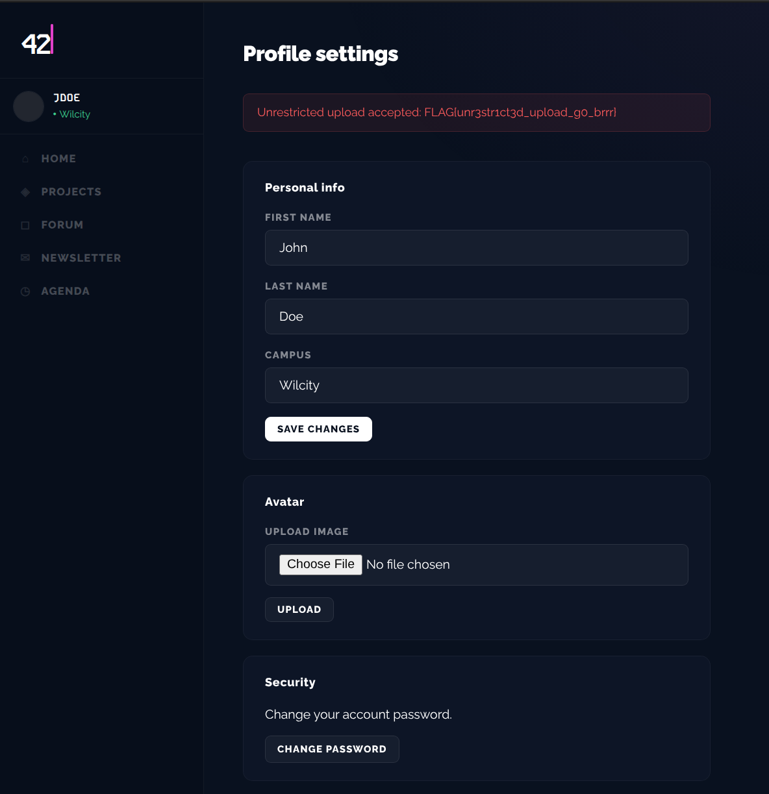

# Breach 02 — Unrestricted File Upload → Code Execution

**OWASP:** A05:2021 – Security Misconfiguration / A03 (injection of code)
**Flag:** `FLAG{unr3str1ct3d_upl0ad_g0_brrr}`

## What it is
An upload endpoint that accepts a file without validating its **type,
extension, and content**, and then stores it somewhere the web server will
**execute** it. This turns "store this file" into "run my code."

## How the breach works
1. Once logged in as a student (account takeover — breach 04), the profile page
   exposes an **avatar uploader** — i.e. a write path to the server filesystem.

   
   

2. There is no MIME/extension/content check, so a PHP file is accepted:

   ```php
   <?php echo system('id'); ?>
   ```

3. When the stored file is served, the server executes it and returns the flag.

   

`./exploit.sh` reproduces the upload with a minimal proof-of-concept payload.
> The payload only runs `id` to *prove* execution — it is deliberately not a
> weaponised reverse shell.

## Impact
Arbitrary code execution in the application context — full compromise of the
web application and everything it can reach.

## How it could have been avoided (remediation)
- Validate uploads against an **allow-list** of extensions *and* verify real
  content type (magic bytes), not the client-supplied `Content-Type`.
- **Rewrite filenames**, store uploads **outside the web root**, and serve them
  from a domain/handler that never executes code.
- Strip execute permissions; scan and size-limit uploads. Any one of these,
  correctly applied, breaks the chain.
