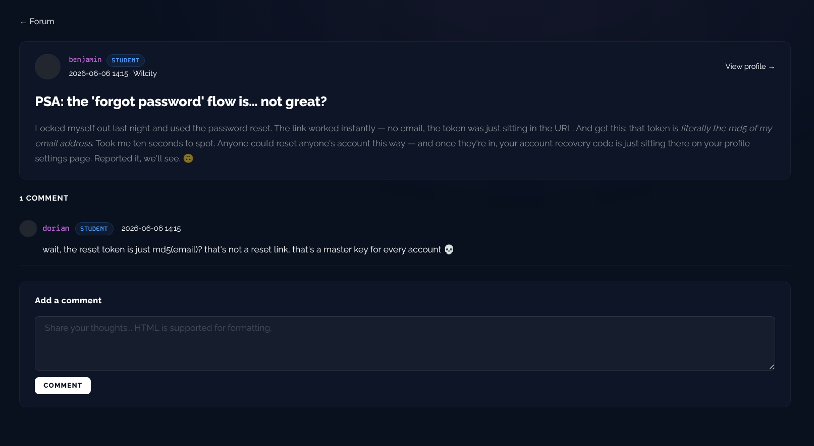
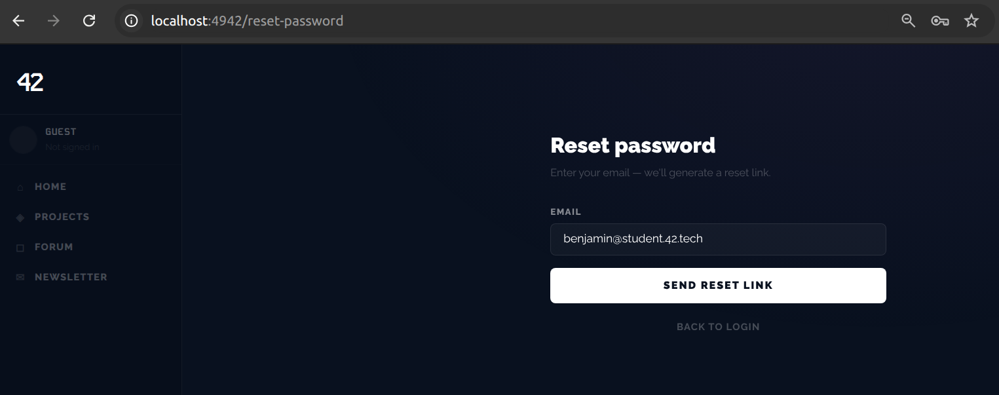

# Breach 04 — Insecure Password Reset (MD5 token)

**OWASP:** A07:2021 – Identification & Authentication Failures
**Flag:** `FLAG{r3s3t_t0k3n_w4s_just_md5_lol}`

## What it is
A password-reset flow whose "token" is **deterministic and derived from public
data** — here, `md5(email)`. Anyone who knows the email can reproduce the token
offline, so the reset proves nothing about controlling the mailbox.

## How the breach works
1. A student, `benjamin`, posts a public "PSA" on the forum outing the bug on
   himself: the reset link worked with no email, the token was just sitting in
   the URL, and it's literally `md5(email)` — adding that "once they're in, your
   account recovery code is just sitting there on your profile settings page."
   He names both the flaw and where its flag lives.

   

2. We request a password reset for `benjamin`'s own (public, see breach 01) email.

   

3. Decoding the token in the reset URL shows it equals `md5(benjamin's_email)`:

   
   

4. We set a new password with the forged token and log in as `benjamin`.

   

5. Exactly as he described, `/profile/me/settings` has a box literally labelled
   "Account recovery code" — that's the flag.

   

`./exploit.sh` computes the token with `md5sum` and drives the reset.

## Impact
Full account takeover of **any** user whose email is known — no mailbox access
required. Combined with breach 01 (public emails), it is universal.

## How it could have been avoided (remediation)
- Reset tokens must be **high-entropy (CSPRNG), single-use, time-limited, and
  bound server-side** to the account — stored hashed and invalidated on use.
- Never derive a token from a public identifier; validate it **server-side**
  against stored state (not on the client).
