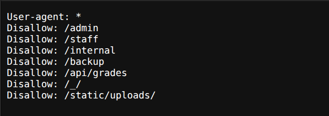
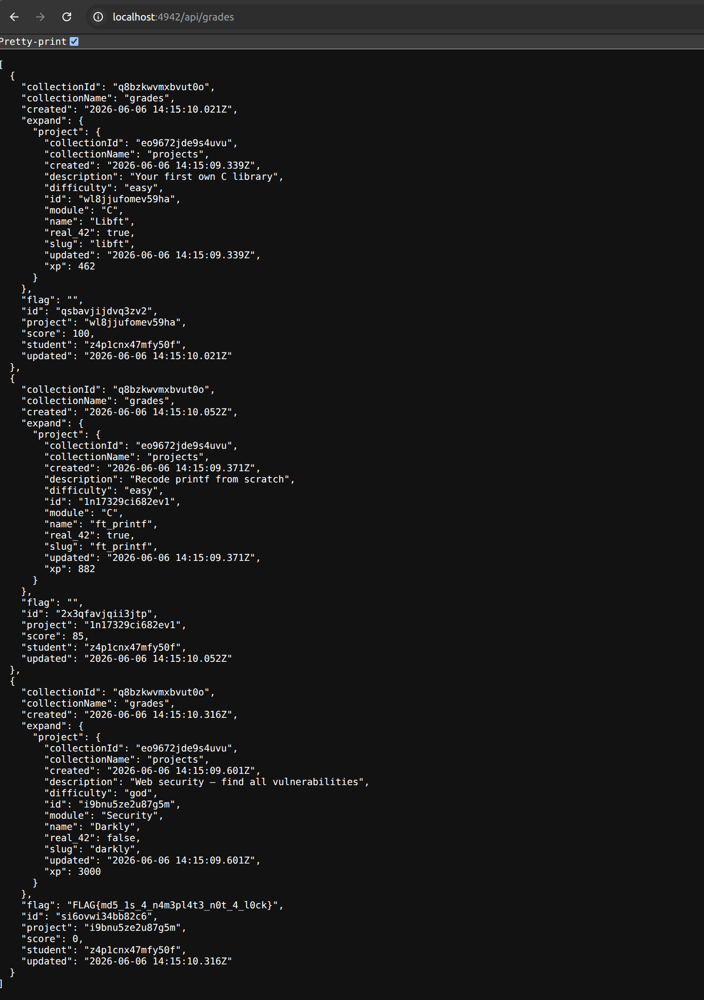

# Breach 05 — Hidden / Unprotected API Endpoint

**OWASP:** A01:2021 – Broken Access Control (also A05 misconfiguration)
**Flag:** `FLAG{md5_1s_4_n4m3pl4t3_n0t_4_l0ck}`

## What it is
Relying on `robots.txt` (or obscurity) to "hide" a sensitive endpoint instead
of protecting it with authentication and authorisation.

## How the breach works
1. `robots.txt` disallows several high-value paths — a curated map for an
   attacker. Most are 403/redirects, but one is simply public.

   

2. `/api/grades` returns data to an unauthenticated guest, including the flag.

   

`./exploit.sh` pulls `robots.txt` then hits the unprotected endpoint.

## Impact
Unauthenticated disclosure of data that should require authorisation; the
`robots.txt` list also accelerates discovery of every other sensitive route.

## How it could have been avoided (remediation)
- **`robots.txt` is not access control.** Protect sensitive endpoints with
  real authentication + authorisation, regardless of whether they are listed.
- Do not enumerate private paths in `robots.txt`; return 401/403 for
  unauthorised access rather than serving data.
