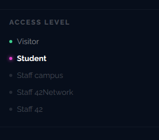
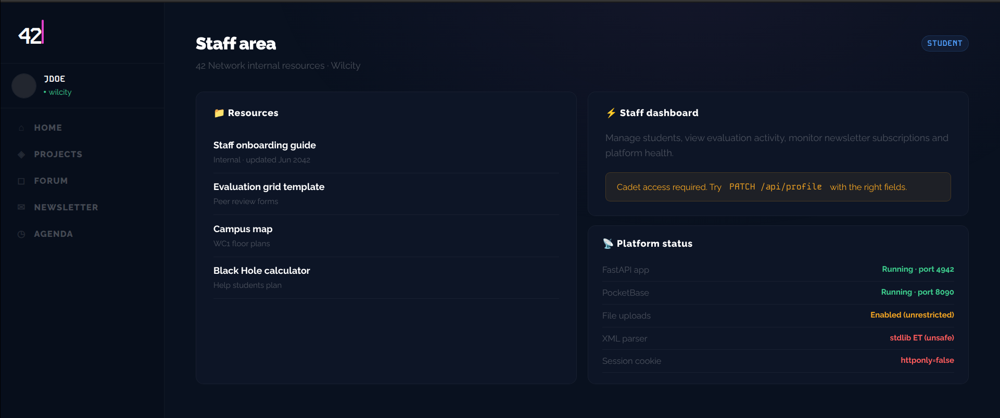

# Breach 06 — Mass Assignment

**OWASP:** A08:2021 – Software & Data Integrity / A01 – Broken Access Control
**Flag:** `FLAG{just_p4tch_y0ur_0wn_r0l3_lol}`

## What it is
The framework binds incoming request fields **directly onto the data model**
without an allow-list, so a client can set fields the developer assumed were
internal — here, the `role` that controls privilege.

## How the breach works
1. As a student, privileges are minimal — the goal is to become campus staff.

   

2. A hint in `/staff` suggests `PATCH /api/profile`.

   

3. Using Burp Repeater, a normal request is changed to `PATCH /api/profile`
   with a body carrying the privileged field:

   ```http
   PATCH /api/profile HTTP/1.1
   Content-Type: application/json
   Cookie: session=<student session>

   {"role":"cadet"}
   ```

   

4. The server returns `200 OK`, applies the change, and the Staff Area unlocks
   with the flag.

   
   

`./exploit.sh` reproduces the PATCH with curl.

## Impact
Vertical privilege escalation with a single request — no admin interaction,
no other bug required.

## How it could have been avoided (remediation)
- **Never bind privileged fields from user input.** Use explicit input DTOs /
  allow-listed fields for profile updates.
- Make authorisation-relevant attributes (`role`, `is_admin`, `verified`)
  writable only through a separate, server-authorised code path.
