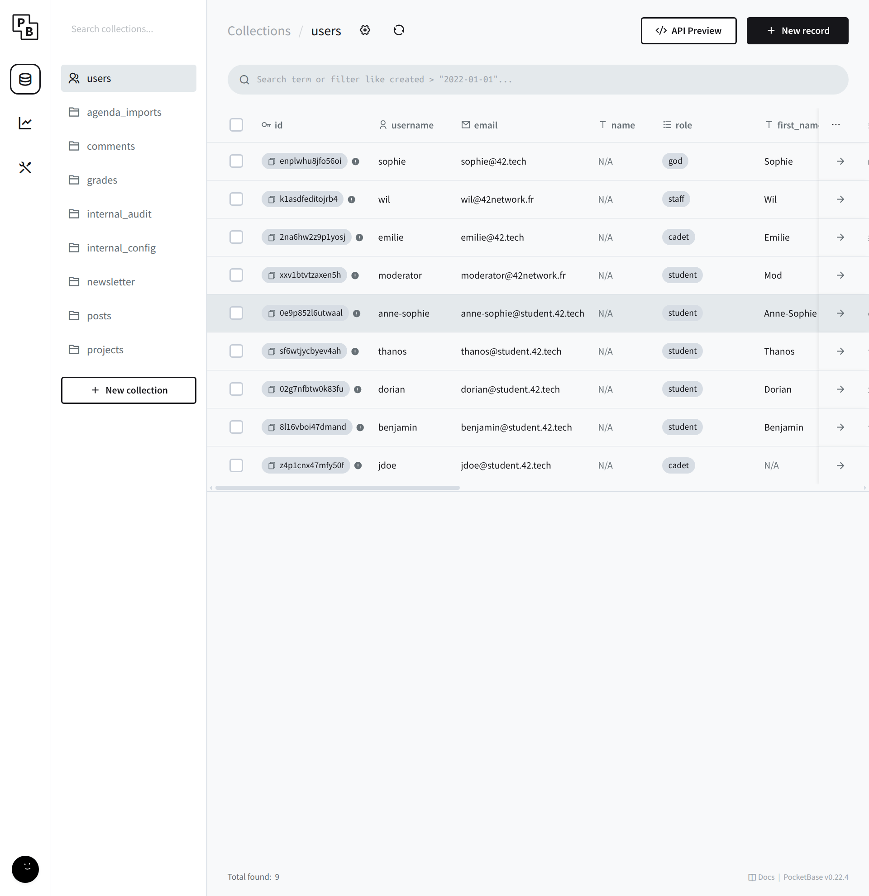
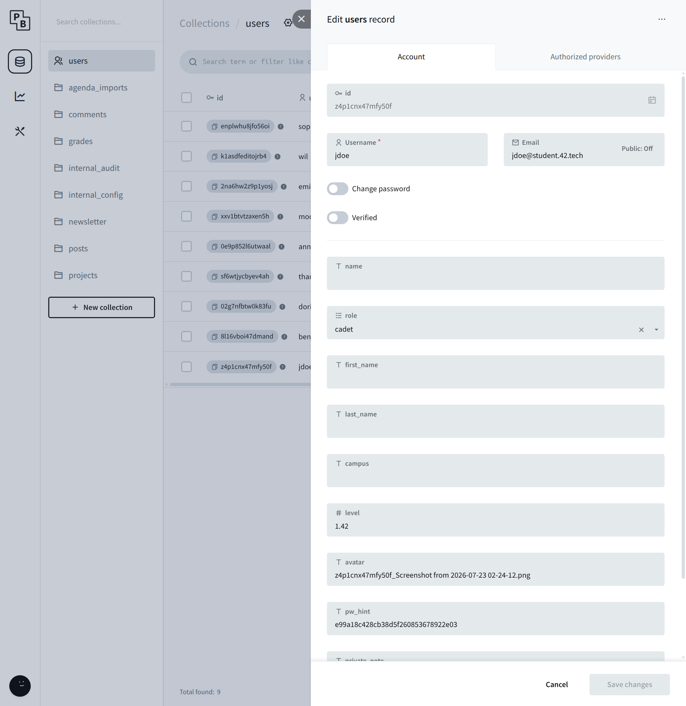

# Breach 08 — Privilege Escalation via PocketBase

**OWASP:** A01 – Broken Access Control / A05 – Security Misconfiguration
**Flag:** `FLAG{th3_und3rsc0r3_sl4sh_kn0ws_th3_w4y}`

## What it is
Leaked, static admin credentials + a reachable backend admin console = total
database control that bypasses the application's entire role model.

## How the breach works
1. The XXE (breach 07) leaked the PocketBase admin creds; the `x-pocketbase`
   header points at `http://localhost:8090/_/`. Logging in exposes every user
   and collection.

   
   

2. We can edit any record — e.g. elevate our own role to `god`.

   
   

3. Enumerating collections, `internal_audit` holds the flag.

   

`./exploit.sh` authenticates to the admin API and reads the collection.

## Impact
Complete database compromise — read/modify every user, role, and record.
This is the top of the privilege ladder (application administrator).

## How it could have been avoided (remediation)
- Never expose the backend admin console to untrusted networks; bind it to
  localhost + VPN/bastion only.
- Use **strong, unique** admin credentials from a secrets manager (not shared,
  not leakable via config); rotate them.
- Keep secrets out of any endpoint reachable via app bugs (see breach 07).
