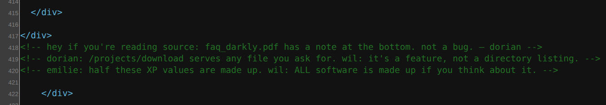
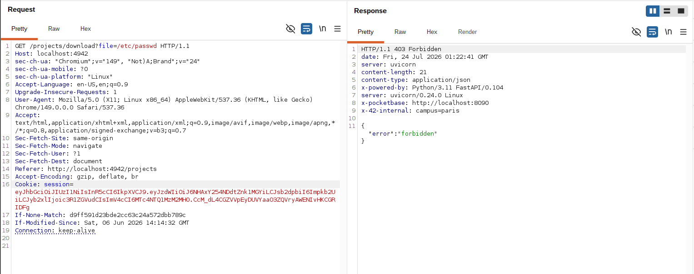

# Breach 09 — Local File Inclusion (Path Traversal)

**OWASP:** A01 – Broken Access Control / A05 – Security Misconfiguration
**Flag:** `FLAG{d0t_d0t_sl4sh_4ll_th3_w4y_d0wn}`

## What it is
A file-serving parameter that resolves attacker input into a filesystem path
without canonicalising and confining it to a safe base directory, allowing
`../` traversal to files outside the intended folder.

## How the breach works
1. `/project` serves `faq_darkly.pdf` via a `file` parameter — the classic LFI
   sink.

   

2. `/etc/passwd` is 403 and naive traversal is 404 — partially hardened.

   
   

3. The **response headers** disclose the sensitive target and layout:

   ```text
   x-backup-dest:    localhost:/opt/pocketbase/pb_data
   x-backup-exclude: data/private_notes.txt
   ```

   

4. Iterating the traversal depth (the filter mishandled `../` at a specific
   depth) resolves `private_notes.txt` and yields the flag.

   

`./exploit.sh` reads the headers, then sweeps traversal depths.

## Impact
Disclosure of arbitrary server-side files (private notes, config, secrets)
outside the intended document directory.

## How it could have been avoided (remediation)
- **Canonicalise** the resolved path and verify it stays within an explicit
  base directory; reject anything that escapes it (do not blocklist `../`).
- Prefer serving documents by **opaque id** from a lookup table, never by
  client-supplied path. And stop disclosing paths in HTTP headers.
