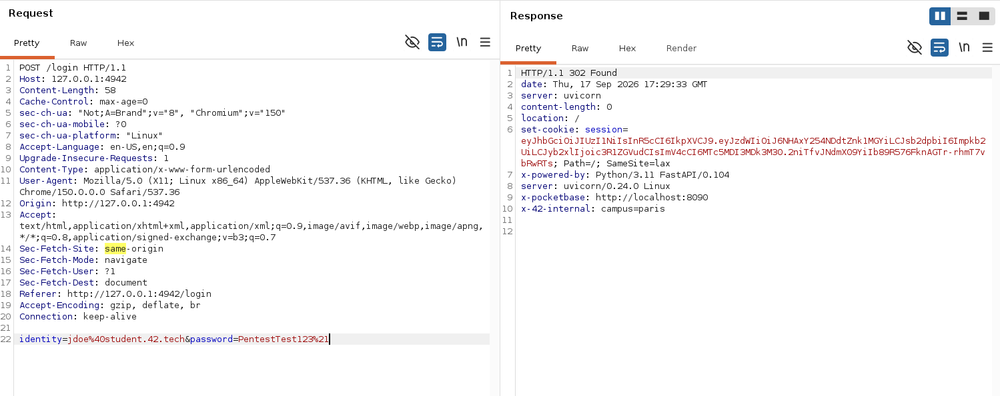

# Breach 10 — CSRF (no server-side Origin/Referer validation)

**OWASP:** A01:2021 – Broken Access Control (CSRF)
**Flag:** `FLAG{csrf_4ny_0r1g1n_1s_w3lc0m3}`

## What it is
`POST /profile/me/settings` (updates `first_name`/`last_name`/`campus`) performs
no CSRF defense of its own: no CSRF token in the form, and no server-side check
of `Origin`/`Referer`. The **only** thing standing between an attacker and this
endpoint is the session cookie's `SameSite=Lax` attribute — a client-side,
best-effort browser mitigation, not something the server enforces.

## How the breach works
1. Log in normally and inspect the session cookie:

   

   ```text
   set-cookie: session=eyJhbGciOiJIUzI1NiIs...; Path=/; SameSite=lax
   ```

   No `Secure`, no `HttpOnly`, `SameSite=lax`.

2. First instinct is the classic `SameSite=Lax` bypass: turn the state-changing
   request into a **GET** (Lax still allows the cookie on a top-level cross-site
   GET navigation). Tested `GET /profile/me/settings?first_name=x&...` — dead
   end, the route only *renders* the page on GET, it never applies the update.

3. Went back to basics: does the server check who's asking at all? Sent the
   real `POST /profile/me/settings` to Burp Repeater and added a completely
   fake `Origin` header pointing at a domain we don't own:

   

   ```text
   POST /profile/me/settings HTTP/1.1
   Origin: https://example.com
   Cookie: session=<valid session>

   first_name=CSRF_ORIGIN_TEST&last_name=Doe&campus=Wilcity
   ```

   It just worked — `302`, and the flag came back in the redirect:

   ```text
   location: /profile/me/settings?csrf_flag=FLAG%7Bcsrf_4ny_0r1g1n_1s_w3lc0m3%7D
   ```

4. **Honest caveat, tested for real:** the textbook exploit — an
   auto-submitting cross-origin `<form method="POST">` — was driven against
   the live app in a real Chromium browser with the victim's cookie already
   set. Result: the browser correctly withheld the `SameSite=Lax` cookie on
   that cross-site POST and the request bounced to `/login`. So the *naive*
   "host this HTML page and wait" version of the attack does **not** work
   against a fully up-to-date browser:

   ```html
   <html><body onload="document.forms[0].submit()">
     <form action="http://127.0.0.1:4942/profile/me/settings" method="POST">
       <input type="hidden" name="first_name" value="PWNED_BY_CSRF">
       <input type="hidden" name="last_name" value="Doe">
       <input type="hidden" name="campus" value="Wilcity">
     </form>
   </body></html>
   ```

   That doesn't make the finding fake — it means the real exposure lives in
   whatever `SameSite=Lax` doesn't cover: an attacker-controlled same-site
   subdomain, an older/non-compliant browser or webview, a proxy/extension
   replaying captured requests, or simply direct HTTP tooling (exactly how the
   flag above was captured). The server itself never checks `Origin` — that's
   the whole joke in the flag name: *any origin is welcome*.

`./exploit.sh` reproduces the direct request-forgery proof (step 2/3) with curl.

## Impact
Any authenticated user's profile fields can be modified by a forged request
that never actually originates from the app — full loss of state integrity for
this endpoint, and a textbook demonstration that a single client-side cookie
attribute was carrying 100% of this app's CSRF protection.

## How it could have been avoided (remediation)
- **Never rely on `SameSite` alone.** Validate `Origin` (fallback to `Referer`)
  server-side on every state-changing request, rejecting anything that doesn't
  match the app's own origin.
- Use a **synchronizer CSRF token** (per-session, unpredictable, checked
  server-side) on top of `SameSite` — defense in depth, not a single control.
- If cookies must be readable cross-site for a legitimate reason, prefer
  `SameSite=Strict` where possible and scope cookies tightly (`Secure`,
  `HttpOnly`, narrow `Path`).
